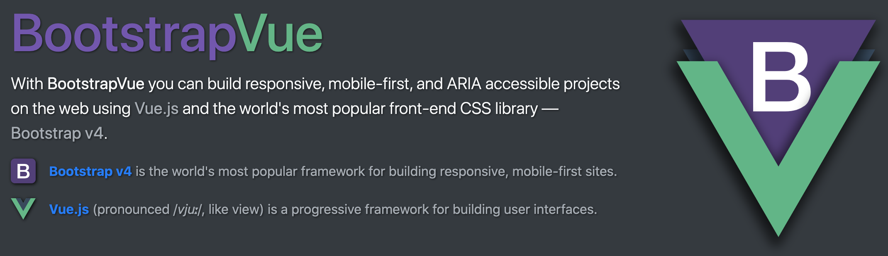
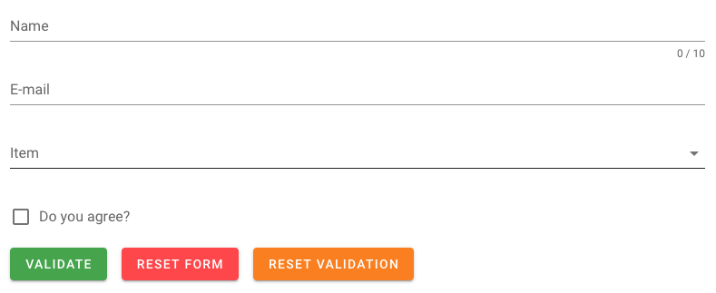
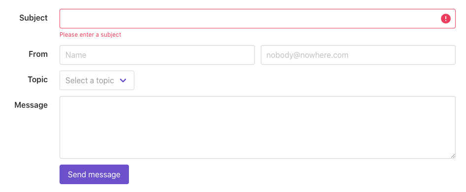
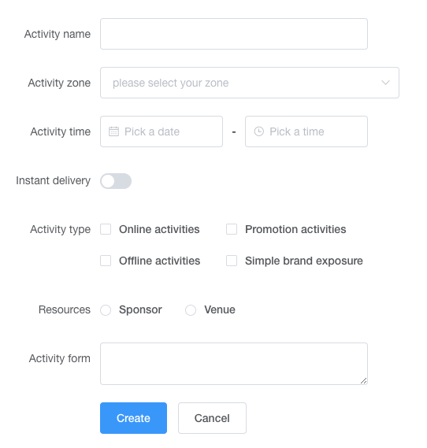
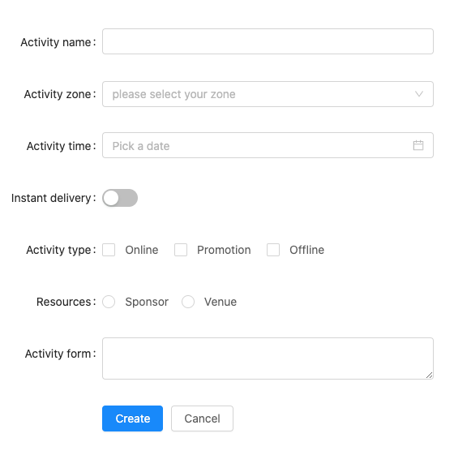

Component Vue UI là công cụ đắc lực giúp tăng hiệu suất, hiệu quả và giảm đáng kể thời gian làm dự án khi sử dụng vue trong các dự án của bạn. Mình xin giới thiệu 5 thư viện Component UI mà bản thân mình đã áp dụng và mình cảm thấy rất tốt tại thời điểm hiện tại.

 

**1. Bootstrap Vue**

Nó cung cấp tất cả nhưng gì Bootstrap có và được xây dựng dể sử dụng các component với Vuejs. Nếu bạn đã và đang dùng bootstrap thì bạn có thể nghĩ tới sử dụng thư viện này. Bootstrap Vue khá mạnh mẽ và có khả năng đáp ứng rất tốt cho các dự án từ nhỏ đến lớn. Tuy nhiên các nhân mình cảm thấy document của thư viện này được viết không tốt cho lắm.
 
 
</img>
 
Trang chủ: https://bootstrap-vue.org/

**2. Vuetify**

Vuetify là một semantic component framework dành cho vuejs. Vuetify được thiết kế theo hường material và có các thành phần UI sạch. Số lượng components hỗ trợ cũng khá ngon. Tuy nhiên bạn nên cân nhắc nó trong các dự án mà UI không thiết kế theo hướng material bởi vì custom em nó cũng khá mệt :))
 
 
</img>
 
Trang chủ: https://vuetifyjs.com/en/

**3. Buefy**

Bao gồm các component cho vuejs và xây dựng trên Bulma.Bulma là một css frame work nhẹ và hướng mobile first. Tuy nhiên trong các dự án lớn buefy có thể không đáp ứng đủ do số lượng components không nhiều.
 
 
</img>
 
Trang chủ: https://buefy.org/

**4. Element UI**

Đạt 47.8k star trên github, Element UI là một thư viện khá phổ biến. Element Ui có số lượng component khá đồ sộ và hầu như đáp ứng được các component mà bạn muốn. Việc sử dụng nó cũng hết sức đơn giản chỉ với đọc document trên trang chủ. Tuy nhiên nó chỉ thích hợp xây dựng cho Desktop. Dĩ nhiên bạn có thể tự responsive được cho các loại màn hình như hệ thông lưới được cung cấp sẵn. Em này là hàng ngon, anh em nên cân nhắc :))
 
 
</img>
 
Trang chủ: https://element.eleme.io/#/en-US

**5. Ant design vue**

Được thiết kế dựa trên Ant design. Ant design cung cấp các template có sẵn và bao gồm các phiên bản cho Vue, React, Angular. Ant design Vue bao gồm đầy đủ các components mà bạn cần để làm dự án lớn và không thua kém gì Element UI. Thực tế mình thấy nó còn ngon hơn Element UI với khả năng cung cấp hệ thông lưới responsive khá tốt. Cá nhân mình khá hài lòng với em này, các bạn có thể thử :))
 
 
</img>
 
Trang chủ: https://antdv.com/docs/vue/introduce/

**Kết luận**

Trên đây là nhưng thư viện Component UI mình thấy khá hữu dụng cho Vue và đều thích hợp cho các dự án từ nhỏ đến lớn. Mình xin kết thúc bài viết tại đây. Hẹn các bạn ở bài viết sau nhé.

__- From ĐMH -__
