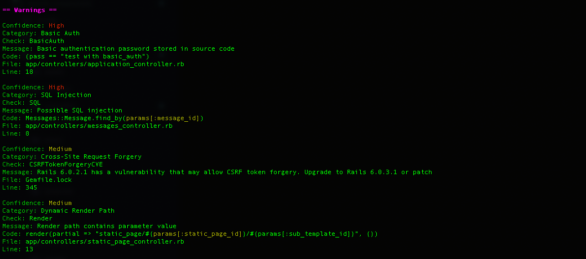

[[snippet]]
| **Khai thác - tấn công - phá hoại** doanh nghiệp từ những lỗ hổng bảo mật trên website luôn là vấn đề đau đầu của nhà phát triển. Việc kiểm tra và cảnh báo trong quá trình development là rất cần thiết.

## Giới thiệu chung

   ### 1. Brakeman là gì?

   

   Brakeman là **Static Application Security Testing (SAST)** công cụ kiểm tra và cảnh báo lỗ hổng bảo mật có thể xảy ra dựa trên source code tĩnh được viết cho các ứng dụng rake như Sinatra, Ruby on Rails,.. Ngoài các lỗ hổng phổ biến và nguy hiểm như là [SQL Injection](https://guides.rubyonrails.org/security.html#sql-injection) và [Cross Site Request Forgery](https://guides.rubyonrails.org/security.html#cross-site-request-forgery-csrf) nói chung thì Brakeman còn đưa ra cảnh báo cho các lỗi bảo mật của ứng dụng Rails nói riêng như là [Attribute Restriction](https://brakemanscanner.org/docs/warning_types/attribute_restriction/), [Cross Site Scripting (Content Tag)](https://brakemanscanner.org/docs/warning_types/content_tag), vv ...

   Mặc dù trong [tài liệu](https://guides.rubyonrails.org/security.html) của Rails đã đề cập đến và đưa ra cách mà Rails xử lý nhưng trong quá trình phát triển thực tế thì việc thiếu xót là không thể tránh khỏi. Vì vậy một công cụ cảnh báo như Brakeman kết hợp với CI/CD là rất cần thiết và việc review sẽ trở nên đơn giản hơn.

   Brakeman sẽ căn cứ vào phiên bản Rails của ứng dụng để đưa ra các cảnh báo thích hợp. Hơn nữa vì chỉ đánh gía trên source code tĩnh mà không cần thực thi nên thời gian thực hiện và đưa ra kết quả đánh giá của brakeman rất nhanh.

   ### 2. SQL Injection

   Hacker khai thác lỗi hổng từ các câu lệnh SQL raw. 

   

   Cùng lướt qua một trong những cách tấn công bằng SQL Injection đơn giản nhất nhé

   ```ruby
   User.find_by("login = '#{params[:name]}' AND password = '#{params[:password]}'")
   ```

   Thì hacker có thể truyền tham số là `params[:password]= " '' OR '2'>'1 "` để vượt qua bước kiểm tra mật khẩu để đăng nhập được vào hệ thống như bên dưới.

   ```sql
   SELECT * FROM users WHERE login = 'tomoblo' AND password = '' OR '2'>'1' LIMIT 1
   ```

Đứng vị trí Top 1 dựa trên đánh giá [Open Web Application Security Project (OWASP) 2010](https://www.owasp.org/index.php/Top_10_2010-A1) nhưng hiện tại SQL Injection vẫn là một lỗ hổng bảo mật phổ biến mà các website lớn nhỏ rất dễ mắc phải.


   ### 3. Cross-Site Request Forgery (CSRF)

   CSRF là kỹ thuật đánh lừa người dùng bằng cách gửi script đến người dùng khi họ vẫn đang truy cập trang bằng session đã đăng nhập của mình

   

Để tăng thêm lớp bảo mật Rails là chèn thêm một token ẩn vào dưới form và so sánh với biến _csrf_token lưu ở session khi người dùng gửi một phương thức POST đến server.

## Áp dụng

Chỉ cần một bước cài đặt có thể sử dụng ngay brakeman

    # Gemfile
    gem 'brakeman'

   ### 1. Kết quả kiểm tra đánh giá 

  Chạy lệnh `bundle exec brakeman` ở dưới CLI và cùng xem kết quả

 

Chúng ta có thể thấy brakeman trả về thông báo rất rõ ràng:

  * Cảnh báo [Basic authentication](https://guides.rubyonrails.org/getting_started.html#basic-authentication)  của Rails vì trong source code mình đang cố tình gán cố định mật khẩu là `Testing`.

  * Phát hiện một lỗi SQL injection có thể bị khai thác ở mức độ High level

  * Brakeman thông báo Rails có một cập nhật mới để xử lý lỗi [CSRT](https://guides.rubyonrails.org/security.html#cross-site-request-forgery-csrf) tốt hơn

  * Cảnh báo [Dynamic Render Path](https://brakemanscanner.org/docs/warning_types/dynamic_render_paths/) tức đường dẫn này đang bị ảnh hưởng bởi tham số tuỳ ý từ người dùng và trong trường hợp cụ thể này có thể gây hại đến app

   ### 2. Tích hợp với CI/CD

Brakeman cung cấp các [options](https://brakemanscanner.org/docs/options/) linh hoạt tuỳ vào mức độ dự án. Ví dụ như:

* --no-exit-on-warn : Tiếp tục tiến trình CI/CD khi gặp warnings
* --exit-on-error : Dừng tiến trình khi bắt gặp lỗi.
* --except BasicAuth: Bỏ qua lỗi [Basic authentication](https://guides.rubyonrails.org/getting_started.html#basic-authentication) và tiếp tục tiến trình
* vv, ...

Ví dụ mình muốn tất cả commit phải fix hết tất cả các warning ở mức độ medium trở lên và bỏ qua cảnh báo Basic Auth của Rails:

    # cicleci/config.yml
    ...
    steps:
      ...
      - run:
          name: Run brakeman
          command: bundle exec brakeman --except BasicAuth --exit-on-warn -w2
      ...


## Tổng kết

Linh hoạt, đơn giản, nhẹ nhàng tại sao chúng ta không áp dụng brakeman vào dự án của mình. Để brakeman có thể giúp ta tránh được những rủi ro tiềm tàng mà chúng ta có thể xử lý được. Chúng ta hãy cùng cân nhắc cái giá phải trả của việc lộ thông tin khách hàng và trang website bị phá hoại nếu bị Hacker để mắt đến.

Hy vọng qua bài viết mọi người sẽ hiểu hơn tầm quan trọng cua việc đánh giá kiểm tra bảo mật khi phát triển dự án của mình. Rất cám ơn mọi người đã xem bài viết.

**Tài liệu tham khảo:**

Github: https://github.com/presidentbeef/brakeman

Document: https://brakemanscanner.org/docs

[[author | Huy Nguyen ]]
