[[snippet]]
| Chắc hẳn nhiều bạn làm mobile đều từng nghe đến khái niệm Deep link, App link, Universal link, Dynamic link, URL Scheme. Những khái niệm cũng như cách gọi tên đôi lúc cũng khiến bạn bối rối khó hiểu nhầm lẫn. Bài viết này sẽ cung cấp đầy đủ cho bạn cái nhìn tổng quan về Deep link. 

## 1.Deep link là gì

Giống như cấu trúc http và https để điều hướng user tới website thì deep link là cấu trúc để điều hướng user đi tới một ứng dụng nào đó trên điện thoại. Deep link bao gồm 3 dạng chính: 

- URL Scheme: sử dụng url scheme để mở app 
- App link(Android) và Universal link (iOS): sử dụng địa chỉ web page để mở app
- Custom Deep link (Dynamic link, Repro, Adjust, branch.io): cũng sử dụng địa chỉ web page để mở app nhưng có thêm chức năng thống kê traffic từ link (thường dịch vụ bên thứ 3 phát triển)

Deep link dùng để làm gì:
- Điều hướng qua lại giữa các app, từ website qua app
- Tạo các đường link trao đổi thông tin và thực hiện các chuyển flow trong app khi click vào link
- Thu thập dữ liệu, hành vi người dùng khi click vào link

Dưới đấy mình sẽ đi vào chi tiết cách dùng cài đặt và chú ý khi sử dụng từng loại

## 2.URL Scheme

URL Scheme sẽ có dạng `yourSchemeApp://`. App sẽ được mở lên khi gõ và click đúng scheme này

### Cài đặt

Cài đặt với iOS bạn cần cài đặt trong file `Infor.plist`
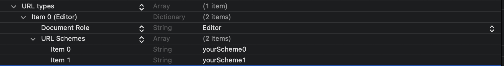

Bạn có thể thử click hoặc gõ trực tiếp từ Safari để mở thử iturn bằng link sau `imst://` hoặc mở AppStore từ link : `itms-apps://`

Với Android URL Scheme chỉ thể dùng khi bạn click trực tiếp vào link. Bạn có thể thử click vào link sau để mở PlayStore tìm kiếm app gmail `market://search?q=gmail`

### Ưu điểm:

- dễ dàng cài đặt phía app
- không cần cài đặt phía backend

### Nhược điểm:

- URL Scheme có thể trùng lặp các app nếu đặt đơn giản
- Không thể điều hướng khi app chưa cài 
- Với iOS trước khi wake app luôn có popup confirm (trừ những app của hệ thống)

## 3.App link, Universal link

Khắc phục điểm yếu của của URL Scheme cả Apple và Google đã phát triển ra App link (Android 6.0) và Universal link (iOS 9.0) sử dụng địa chỉ domain web page làm Deep link wake app.

Cơ chế của Deep link web page này sẽ check nếu trong các app đã cài đặt có config web page trùng với Deep link thì sẽ điều hướng mở app. Ngược lại sẽ mở web page như bình thường. Ở phần mở website này hoàn toàn phía sever có thể check device iOS, Android để điều hướng tới App Store hoặc Play Store và với các device khác thì điều hướng tới trang chủ. Đây là cách mọi người thường xử lý với Deep link web page.

### Cài đặt

Cách cài đặt với Android bạn cần setup đủ phần scheme, host và cả path nếu cần.

Cài đặt với iOS có 2 phần
- cài đặt trên app

Setting Associated domain trong *Identifier*
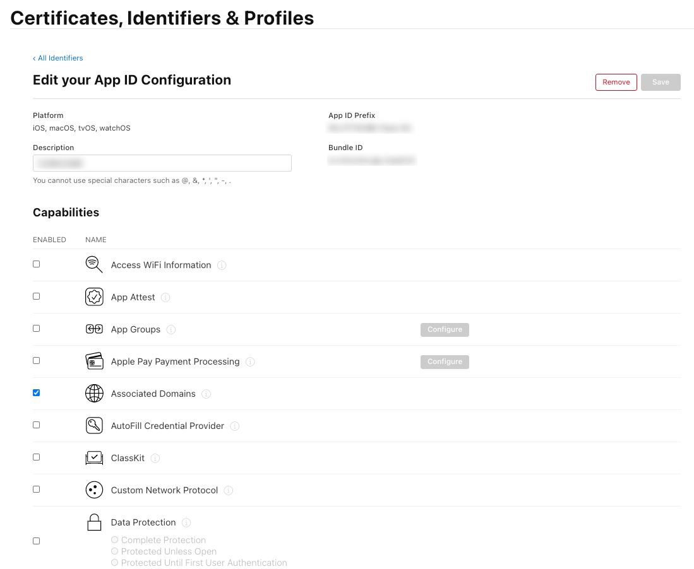

Cài đặt Associated domain trong phần *Singing & Capabillities*
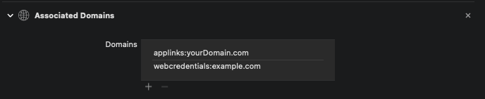

- cài đặt trên sever cần trả về dạng json với đường dẫn `yourUniversalLink.com/apple-app-site-association`
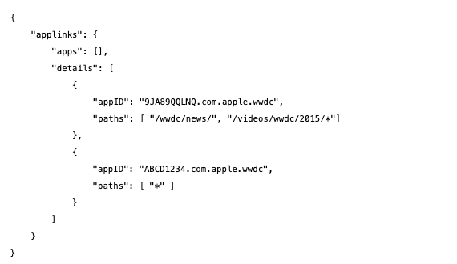

> Ngoài appID chứa team ID và bundleID phần path có thể config Deep link liên kết wake app hay không, chi tiết tham khảo [bài viết](https://developer.apple.com/library/archive/documentation/General/Conceptual/AppSearch/UniversalLinks.html) hướng dẫn của apple

Sau khi cài đặt bạn có thể check tại địa chỉ [này](https://branch.io/resources/aasa-validator/). 

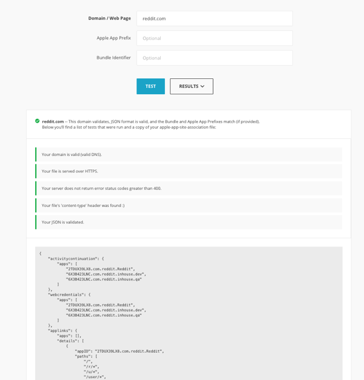

### Ưu điểm:

- địa chỉ domain là duy nhất nên tránh trùng lặp với các app khác
- ngoài wake app ra có thể điều hướng tới Store hoặc website khác phục vụ marketing 
- với iOS không cần popup confirm khi click Deep link

### Nhược điểm:

- cần domain https với iOS
- phụ thuộc setup của sever (apple-app-site-association)
- phụ thuộc vào sever, nếu sever die thì cũng không mở đc app

## 4.Custom Deep link: Firebase Dynamic link

Custom Deep link cũng tương tự như Deep link web page nhưng thường do bên thứ 3 cung cấp. Custom Deep link mang đầy đủ đặc điểm của Deep link web page (App link, Universal link) nhưng có thêm phần thu thập dữ liệu khi user click hoặc tải app

Một vài nhà cung cấp custom Deep link phổ biến: Firebase Dynamic link, branch.io, Appflyers, Repro, Adjust, braze.com, Adbrix... Điểm chung của dịch vụ này là tích hợp kèm với các dịch vụ tracking dữ liệu khác trên đa nền tảng như web, mobile (iOS, Android), socical phục vụ cho việc đo lường hiệu quả các chiến dịch quảng cáo marketing.

Chúng ta cùng tìm hiểu đại diện phổ biến dễ dùng và miễn phí Firebase Dynamic link.

> Với các ứng dụng kinh phí thấp không cần tracking dữ liệu quá phức tạp, Dynacmic link tích hợp cùng dịch vụ Firebase là một lựa chọn tốt

### Cài đặt

Dynamic link bạn có 2 lựa chọn dùng domain của bạn hoặc dùng domain free do Google cung cấp dạng `yourDomain.page.link`. Nếu dùng domain của bạn việc setup sẽ khó khăn hơn. Bạn cần dùng qua Firebase Hosting và xác thực DNS. Chi tiết sẽ hẹn 1 bài gần nhất khi mình setup được :D

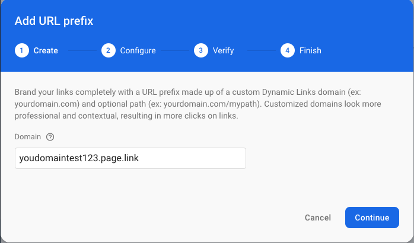

Sau khi setup domain thành công bạn cần setup AppID và TeamID trong mục *Project Setting / General* đối với iOS app. Khi bạn setup xong thì có thể check config tại `yourDomain.page.link/apple-app-site-association` tương tự như Universal link bên iOS. 

Tiếp đến bạn cần tạo Dynamic link mới theo domain đã setup 

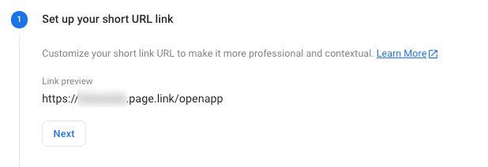

Setting Deep link. Deep link này cùng trùng với Associated domain tương tự như setup trong app App link, Universal link

Setup wake app và tuỳ chọn điều hướng khi app chưa cài với iOS và Android

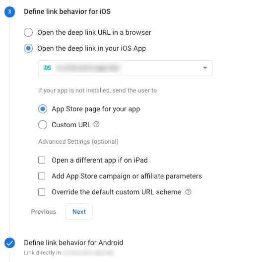

Sau khi cài đặt thành công bạn có thể xem chi tiếp trong mục Link preview (debug) 

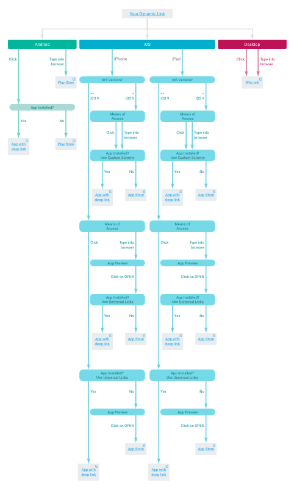

### Thống kê

Ngoài những thống kê đơn giản liên quan đến việc tracking created, clicks, first open, re-open  bạn cần dùng [Analytics API](https://firebase.google.com/docs/reference/dynamic-links/analytics?authuser=1)  để lấy dữ liệu thô chi tiết hơn. 

Biểu đồ thông kê nhanh trong Dynamic link chỉ dành cho nhưng link tạo trực tiếp từ webpage Firebase console chứ không show thống kê từ những link Dynamic link custom tạo từ app.

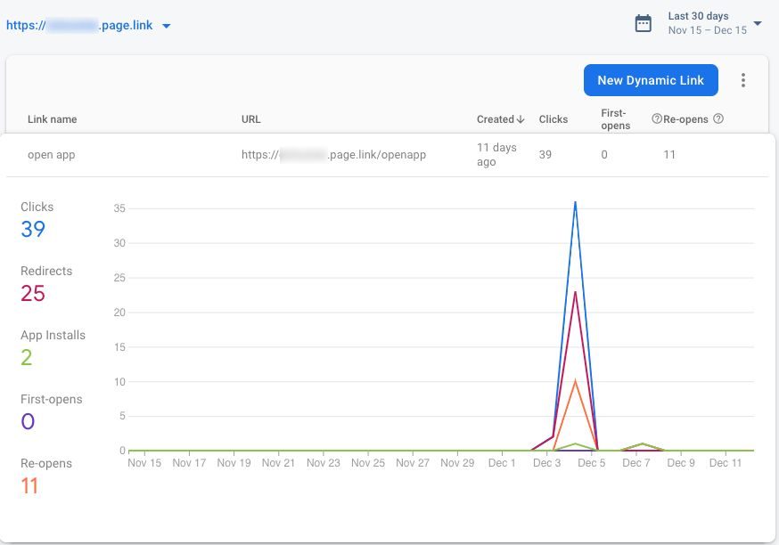 

Nếu bạn dùng dùng mạng Viettel bạn sẽ thấy tin nhắn của MyViettel cũng sử dụng Dynamic link dạng myvt.page.link. Dynamic link này link tới ứng dụng My Viettel.

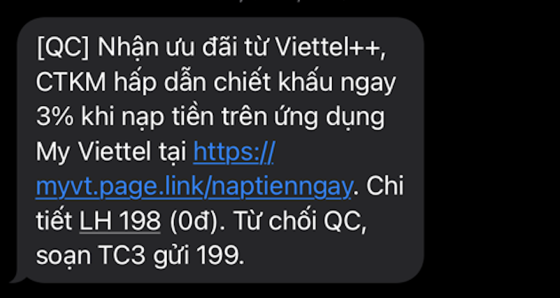 

## 4.Tổng kết

Tất cả các dạng Deep link này đều có thể custom thêm path và query để truyền thông tin thực hiện điều hướng các flow khác nhau. 

> Với user chưa tải app bạn không thể vừa click tải app và mở app lần đầu lấy đc thông tin từ Deep link. Việc lấy thông tin từ Deep link chỉ thực hiện khi user đã tải app. Vậy nên hay tách ra là 2 link tải app và Deep link điều hướng các flow chức năng.

Ví dụ bạn có thể tạo 1 Dynamic link (chi tiết tạo Dynamic link trực tiếp từ app bạn có thể xem tại [đây](https://firebase.google.com/docs/dynamic-links/ios/create?authuser=1)) từ user A mời user B vào room chat của mình. Thông tin truyền vào cần `room` và `user` . Dynamic link sẽ có dạng `yourApp.page.link/joinChat?room=ce98x74Dk&user=tHW94kd`

Bạn cần bóc tách lấy thông tin từ Deep link từng phần scheme, host, path và query để lấy thông tin điều hướng khi user B click vào link này. Với iOS bạn có thể xem cách chi tiết tại link này: [handle URL Scheme](https://developer.apple.com/documentation/xcode/allowing_apps_and_websites_to_link_to_your_content/defining_a_custom_url_scheme_for_your_app) và [handle Universal link](https://developer.apple.com/documentation/xcode/allowing_apps_and_websites_to_link_to_your_content/supporting_universal_links_in_your_app)

Chú ý phần deep link này chứa thông tin nên để đảm bảo an toàn bạn cần mã hoá lại phần path vs query
Bạn có thể dùng mã hoá AES. Link mã hoá sẽ có dạng `yourApp.page.link/VYlCFA1FhPEYjKcvfN7dkNpZoBmM73XBT0hyiF7kZ6`. Để test mã hoá và giải mã AES bạn có thể thử tại [đây](https://www.devglan.com/online-tools/aes-encryption-decryption ).

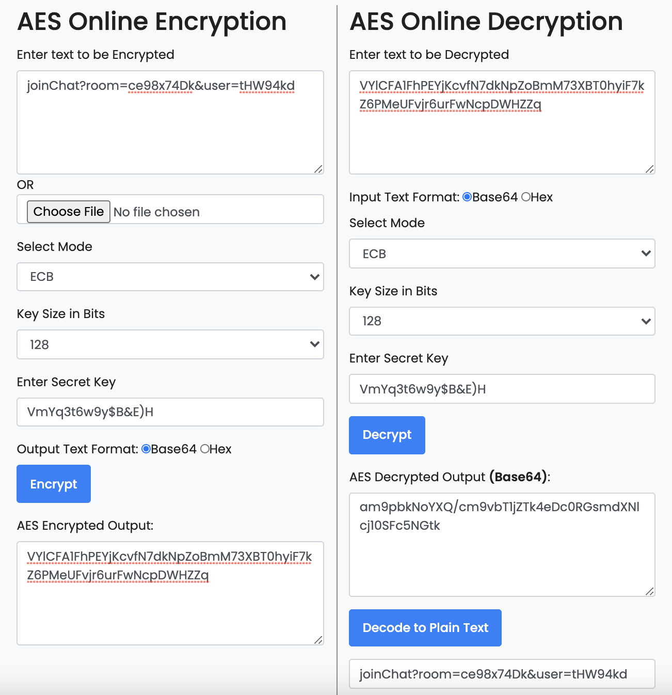

>Hãy đảm bảo rằng key mã hoá và giải mã được đồng nhất.

Trên đây là toàn bộ những thứ mình biết về Deep link. Bài viết có tham khảo nhiều nguồn từ internet sẽ không tránh khỏi những sai sót, rất mong góp ý của mọi người. Cảm ơn mọi người đã đọc bài.

GLHF!

[[author | Lương Tuấn Anh ]]

