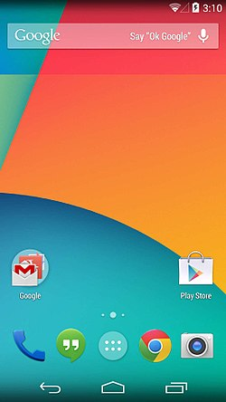
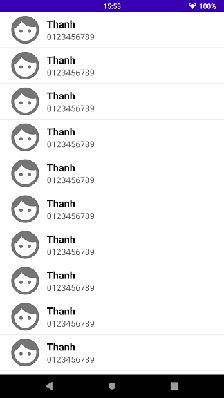
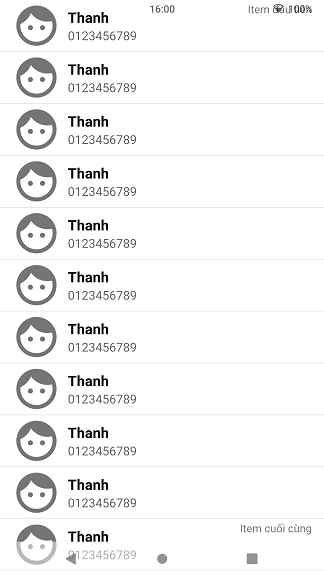
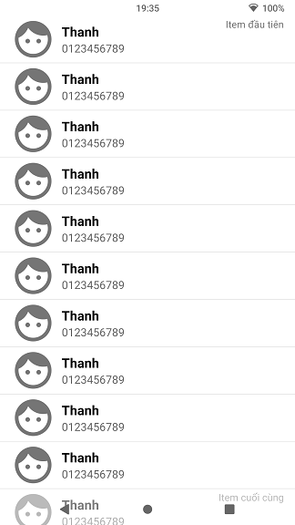

[[snippet]]
| Trong giới lập trình di động, thì mình thấy giao diện của iOS vẫn có gì đó đẹp và ổn hơn của Android. Trong đó có Thanh trạng thái (Status bar) và Thanh điều hướng (Navigation bar) là hai thứ mà người dùng Android vẫn luôn thấy nhà Apple làm đẹp và hoàn chỉnh hơn nhà Google.

## 1. Status bar
Thanh trạng thái ở iOS đã có hiệu ứng trong suốt từ những phiên bản iOS đầu tiên. Nhưng với Android thì ... mãi đến Android 4.4 thì Google mới cho phép lập trình viên thay đổi màu sắc của nó nhưng chỉ là những màu đơn sắc, thậm chí ở phiên bản Android trước đó nó chỉ có màu đen (xấu kinh).

## 2. Navigation bar
Với thanh điều hướng thì Google đi tiên phong so với Apple, khi trên Android đã có nó từ Android 4.0 gần 10 năm trước.

[[image_caption | Giao diện màn hình chính của Android 4.4 ]]
| 

Nhưng nó ra đời khi cằm của điện thoại còn rất dày vẫn chưa mỏng như hiện nay cho nên những chiếc điện thoại thời đó nếu có thanh điều hướng thì vừa có cằm dày và màn hình lại tốn một khoảng cho thanh điều hướng, không những thế thanh điều hướng này cũng không trong suốt nó chỉ có màu đen hoặc trắng, nó xấu đến nỗi hầu hết các hãng làm điện thoại Android không dám đưa nó lên sản phẩm của mình. Phải đợi đến khi Apple "định nghĩa" lại thanh điều hướng trên iPhone X, thì Google mới cho sửa sang lại 3 phím điều hướng ảo của Android.

## 3. Make them transparent
Mặc dù những phiên bản Android gần đây, thanh trạng thái thậm chí cả thanh điều hướng đã có thể trong suốt, nhưng rất nhiều ứng dụng mình đang cài trên điện thoại vẫn chưa áp dụng :(  
Chính vì thế mình sẽ hướng dẫn các bạn làm cho ứng dụng của bạn trở nên đẹp hơn 69 lần với thanh trạng thái và điều hướng trong suốt.

[[image_caption | Khi chưa làm trong suốt]]
| 

Ứng dụng demo của mình sẽ có RecyclerView, mặc định thì sẽ trông như hình trên, ứng dụng được vẽ ở trong SystemUI (gồm thanh trạng thái, thanh điều hướng) để có hiệu ứng trong suốt thì bạn làm như sau:

1. Ở Activity sẽ gọi [`setSystemUiVisibility()`](https://developer.android.com/reference/android/view/View.html#setSystemUiVisibility%28int%29) và truyền các `flag` sau:

		decorView.systemUiVisibility = 
		                View.SYSTEM_UI_FLAG_LAYOUT_FULLSCREEN or  
		                View.SYSTEM_UI_FLAG_LAYOUT_STABLE or  
		                View.SYSTEM_UI_FLAG_LAYOUT_HIDE_NAVIGATION

    - Flag `SYSTEM_UI_FLAG_LAYOUT_FULLSCREEN` để hệ thống vẽ View ở phía dưới Thanh trạng thái.
    - Flag `SYSTEM_UI_FLAG_LAYOUT_HIDE_NAVIGATION` để hệ thống vẽ View ở phía dưới Thanh điều hướng.

2. Với themes.xml (hay styles.xml) chúng ta sẽ đổi màu của thanh trạng thái và thanh điều hướng bằng cách thêm các item sau:

        <item name="android:statusBarColor">@android:color/transparent</item>
        <item name="android:navigationBarColor">#80FFFFFF</item>

    Vì đã trở nên trong suốt thì các icon ở thanh trạng thái và thanh điều hướng phải truyền thành màu đen để người dùng có thể nhìn thấy, thì ta sẽ thêm 2 item sau:

        <item name="android:windowLightStatusBar">true</item>
        <item name="android:windowLightNavigationBar">true</item>

Lưu ý: nếu bạn chuyển màu thanh điều hướng thành trong suốt thì nó lại không trong suốt đâu nên phải để alpha = 50%, thì sẽ có hiệu ứng trong mờ. Nhưng nếu người dùng sử dụng thanh điều hướng cử chỉ (Gesture Navigation a.k.a cái thanh giống iOS trên iPhone X) thì nếu bạn chuyển màu thành trong suốt thì lại được @@.

Tada ta có như hình phía dưới:

[[image_caption | Chưa có Padding]]
| 

Tuy nhiên, bạn có thể thấy item đầu tiên và dưới cùng của RecyclerView thì nó lại bị nằm phía dưới của thanh trạng thái và thanh điều hướng. Do đó, bạn phải set padding để cách hai thanh này bằng cách sau:

    ViewCompat.setOnApplyWindowInsetsListener(view) { v: View, insets: WindowInsetsCompat ->  
        val systemInsets: Insets = insets.systemWindowInsets  
        v.setPadding(  
                v.paddingLeft, systemInsets.top,  
                v.paddingRight, systemInsets.bottom  
        )  
        insets  
    }

Cơ bản thì đoạn code trên sẽ lắng nghe các số đo của điện thoại trong đó có thanh điều hướng và thanh trạng thái, rồi set padding trên và dưới cho RecyclerView.

- Chú ý: thêm `android:clipToPadding="false"` vào RecyclerView để các item không bị cắt 4 cạnh theo padding được truyền vào. Mình nói thì hơi khó hiểu nhưng các bạn cứ thêm vào thì sẽ thấy tác dụng của nó.

Và đây là kết quả:

[[image_caption | Thành quả nè]]
| 

Thế là giao diện ứng dụng của bạn đã đẹp hơn 69 lần rồi đấy. Các bạn cứ làm như hướng dẫn là được. 

## 4. One more thing: 
Nếu bạn nào ngại viết mấy dòng code lắng nghe rồi set padding thì có thư viện đây [Insetter](https://github.com/chrisbanes/insetter) của [Chris Banes](https://medium.com/androiddevelopers/windowinsets-listeners-to-layouts-8f9ccc8fa4d1), thay vì viết vào code thì bạn chỉ cần set trực tiếp vào .xml (cơ bản thì anh ấy sử dụng Data Binding để set padding vào view).

[[author | Vũ Tiến Thành]]