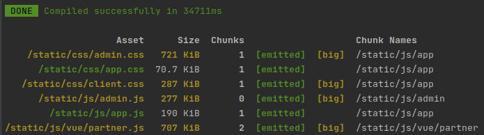

[[snippet]]
| Laravel Mix là một công cụ để biên dịch và tối ưu hóa nội dung trong dự án Laravel. Nó tương tự như một công cụ xây dựng như gulp, Grunt,... Với những dự án nhỏ thì có vẻ bạn cảm thấy không có gì khác biệt lắm, nhưng với những dự án lớn thì điều này thực sự cần thiết, bạn sẽ thấy rõ được sự khác biệt khi chúng ta tối ưu nó. Việc tối ưu này sẽ giúp chúng ta giảm kích thước lưu trữ và tối ưu băng thông. Việc làm này sẽ giúp trang web của chúng ta tải nhanh hơn, mang tới người dùng có trải nghiệm tốt hơn. Laravel Mix được xây dựng dành riêng cho Laravel nhưng cũng có thể được sử dụng bên ngoài như một gói npm.
Nói ngắn gọn: Laravel Mix quản lý tất cả tài nguyên (assets) như img, css, js trong dự án của bạn, đồng thời nó dựa trên base là webpack build tất cả các file css, js pre-processors như SCSS, SASS thành css, chuyển ES6 thành ES5 (trình duyệt không hiểu cú pháp ES6).

##I. Cài đặt Laravel Mix
###Với Laravel
Nếu bạn đang sử dụng Laravel 5.4 trở về sau, thì mix đã được cài đặt. Tất cả những gì bạn phải làm là chạy `npm install`.

### Với các dự án độc lập
Từ gốc ứng dụng của bạn, hãy chạy các commands sau:
```bash
npm init -y
npm install laravel-mix --save-dev
cp node_modules/laravel-mix/setup/webpack.mix.js ./
```
Trong file `package.json` hãy thêm đoạn sau:
```javascript
"scripts": {
    "dev": "npm run development",
    "development": "cross-env NODE_ENV=development node_modules/webpack/bin/webpack.js --progress --hide-modules --config=node_modules/laravel-mix/setup/webpack.config.js",
    "watch": "npm run development -- --watch",
    "hot": "cross-env NODE_ENV=development node_modules/webpack-dev-server/bin/webpack-dev-server.js --inline --hot --config=node_modules/laravel-mix/setup/webpack.config.js",
    "prod": "npm run production",
    "production": "cross-env NODE_ENV=production node_modules/webpack/bin/webpack.js --no-progress --hide-modules --config=node_modules/laravel-mix/setup/webpack.config.js"
}
```
##II. Configure Laravel Mix
Chúng ta có thể cấu hình và gọi các phương thức khác nhau để biên dịch các tệp CSS, JS và đưa vào một thư mục public. Các file được tạo ra bao gồm các file đã cấu hình bên trong tệp `webpack.mix.js`. Tệp tin `webpack.mix.js` sẽ nằm trong thư mục gốc của dự án Laravel. Hãy coi tệp này là cơ sở chính của bạn cho tất cả cấu hình front-end.
```javascript
const mix = require('laravel-mix');

mix.js('resources/js/app.js', 'public/js')
    .sass('resources/sass/app.scss', 'public/css');
```
Nó đã được preconfigured để compile 1 file ở resources/js/app.js vào file public/js và resources/sass/app.scss vào public/css.\
Có rất nhiều phương thức Mix khác và bạn có thể thấy tất cả các methods đó trong file default webpack.mix.js.
```javascript
// Full API
// mix.js(src, output);
// mix.react(src, output); <-- Identical to mix.js(), but registers React Babel compilation.
// mix.preact(src, output); <-- Identical to mix.js(), but registers Preact compilation.
// mix.coffee(src, output); <-- Identical to mix.js(), but registers CoffeeScript compilation.
// mix.ts(src, output); <-- TypeScript support. Requires tsconfig.json to exist in the same folder as webpack.mix.js
// mix.extract(vendorLibs);
// mix.sass(src, output);
// mix.less(src, output);
// mix.stylus(src, output);
// mix.postCss(src, output, [require('postcss-some-plugin')()]);
// mix.browserSync('my-site.test');
// mix.combine(files, destination);
// mix.babel(files, destination); <-- Identical to mix.combine(), but also includes Babel compilation.
// mix.copy(from, to);
// mix.copyDirectory(fromDir, toDir);
// mix.minify(file);
// mix.sourceMaps(); // Enable sourcemaps
// mix.version(); // Enable versioning.
// mix.disableNotifications();
// mix.setPublicPath('path/to/public');
// mix.setResourceRoot('prefix/for/resource/locators');
// mix.autoload({}); <-- Will be passed to Webpack's ProvidePlugin.
// mix.webpackConfig({}); <-- Override webpack.config.js, without editing the file directly.
// mix.babelConfig({}); <-- Merge extra Babel configuration (plugins, etc.) with Mix's default.
// mix.then(function () {}) <-- Will be triggered each time Webpack finishes building.
// mix.override(function (webpackConfig) {}) <-- Will be triggered once the webpack config object has been fully generated by Mix.
// mix.dump(); <-- Dump the generated webpack config object to the console.
// mix.extend(name, handler) <-- Extend Mix's API with your own components.
// mix.options({
//   extractVueStyles: false, // Extract .vue component styling to file, rather than inline.
//   globalVueStyles: file, // Variables file to be imported in every component.
//   processCssUrls: true, // Process/optimize relative stylesheet url()'s. Set to false, if you don't want them touched.
//   purifyCss: false, // Remove unused CSS selectors.
//   terser: {}, // Terser-specific options. https://github.com/webpack-contrib/terser-webpack-plugin#options
//   postCss: [] // Post-CSS options: https://github.com/postcss/postcss/blob/master/docs/plugins.md
// });
```
Với các phương thức này, bạn có thể gói gọn nhiều nhất có thể và không cần phải lo lắng về webpack build căn bản.
###Một số phương thức hay được sử dụng
Laravel có các phương thức như `less()`, `sass()`, `stylus()` để hỗ trợ compile các css pre-prosessor ra các file css mà trình duyệt có thể hiểu được. Cú pháp thực hiện như sau:
```javascript
mix.less('resources/assets/style.less', 'public/assets');
mix.sass('resources/assets/style.less', 'public/assets');
mix.stylus('resources/assets/style.less', 'public/assets');
```
Để compile các file css thông thường thành 1 file ta dùng phương thức `styles()`, và tương tự với js ta dùng `scripts()`:
```javascript
mix.styles([
    'resources/assets/css/bootstrap-datepicker.css',
    'resources/assets/css/jquery.timepicker.min.css'
 ], 'public/css/datetimepicker.css');

mix.scripts([
     'resources/assets/js/bootstrap-datepicker.js',
     'resources/assets/js/jquery.timepicker.min.js'
 ], 'public/js/datetimepicker.js');
```
Hoặc chỉ đơn giản là `copyDirectory()` (copy thư mục) hay `copy()` (copy file):
```javascript
mix.copyDirectory('resources/assets/admin', 'public/assets/admin');
mix.copy('resources/assets/admin.js', 'public/assets/admin.js');
```
Đánh dấu phiên bản đầu ra:\
Tính năng này khá hay. Thông thường các trình duyệt sẽ cache các file css, js trong một khoảng thời gian. Để khắc phục điều này ta sẽ dùng phương thức `version()`. Phương thức này sẽ ép trình duyệt xóa cache và tải các file với phiên bản mới nhất. Phương thức này sẽ thêm một mã hash tại thời điểm chạy.
```javascript
mix.js('resources/assets/js/app.js', 'public/js')
.version();
```
Để biết kết quả sau khi sử dụng phương thức `version()` bạn hãy tìm đến file `mix-manifest.json` trong thư mục public. Nó sẽ trông như thế này.
```javascript
"/static/js/app.js": "/static/js/app.js?id=8b71863dc9a7570ebc77", 
"/static/css/app.css": "/static/css/app.css?id=b8a621a46db684d19bc4"
```
Khi sử dụng phương thức `version()` bạn cần lấy được version của laravel mix hiện tại. Laravel hỗ trợ việc này, đơn giản bạn chỉ cần gọi phương thức `mix()` trong view của mình.
```html
<link rel="stylesheet" href="{{ mix('/css/app.css') }}">
```
##III. Compiling
Sau khi configure những file cần mix trong ứng dụng của bạn, có rất nhiều commands mà chúng ta có thể chạy để có thể build file này.
Cũng giống như composer sử dụng file composer.json để quản lý các package, npm sử dụng file package để quản lý các các thư viện được sử dụng trong dự án. Một số commands cơ bản để compiling bạn có thể thấy chúng trong file package.json đã được đề cập trong phần cài đặt laravel mix.
- `npm run dev` Câu lệnh này sẽ thực thi mix các file một lần.
- `npm run watch` Câu lệnh này sẽ thực thi mix các file hiện tại và theo dõi các file cần mix (là những file trong thư mục webpack.mix.js) khi có sự thay đổi thì nó sẽ mix cho chúng ta luôn. Cái này chúng ta rất hay sử dụng trong dự án.
- `npm run hot` Câu lệnh này thực thi tất cả các tác vụ mix nhưng vẫn active và theo dõi sự thay đổi các tài nguyên, nếu có sự thay đổi, nó thực hiện cập nhật chỉ các module có sự thay đổi, sau đó nó báo cáo với ứng dụng về sự thay đổi và cập nhật mã trong trình duyệt mà không có tải lại tài nguyên.
- `npm run prod` Thực thi tất cả các tác vụ Mix và tối ưu (minify) các file kết quả đầu ra, khi đó bạn có thể sử dụng các kết quả để triển khai ứng dụng trên máy chủ.

Đây là kết quả sau khi sử dung `npm run prod` trong dự án của mình.

##IV. Kết luận
Trong bài viết này, chúng ta đã tìm hiểu cách làm việc với Laravel Mix trong các ứng dụng để giúp cho việc biên dịch css, js,.. trở nên dễ dàng. Bài viết này chỉ là phần giới thiệu cơ bản, để tìm hiểu thêm về Laravel Mix bạn hãy truy cập [trang tài liệu](https://laravel.com/docs/8.x/mix) chính thức của Laravel hoặc truy cập [trang web](https://laravel-mix.com/docs/3.0/installation) Laravel Mix.\
Hy vọng sau bài viết này, mọi người có thể áp dụng được Laravel Mix vào các dự án của mình. Mong nhận được nhiều đóng góp từ mọi người để các bài viết sau có thể hoàn thiện hơn ạ.

######                    *<div style="text-align: right"> - [Phu Thai | Đồng Phú Thái] </div>*
