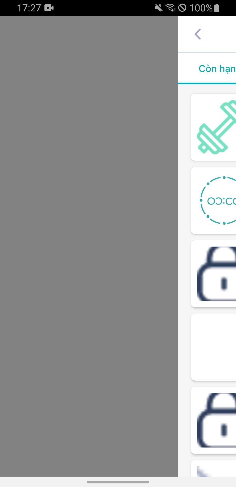

[[snippet]]
| Navigation Component là 1 libs xịn xò do chủ nhà Google cung cấp, giúp anh em lập trình viên dễ dàng navigate, pass-data, add animation ... giữa các màn. Tuy nhiên sau khi sử dụng, mình gặp phải 1 vài Issues đối với lib này.
Còn nếu bạn chưa biết về Navigation Component, có thể tham khảo docx của google: [https://developer.android.com/guide/navigation](https://developer.android.com/guide/navigation)<br></br>
<iframe width="560" height="315" src="https://www.youtube.com/embed/Y0Cs2MQxyIs" title="YouTube video player" frameborder="0" allow="accelerometer; autoplay; clipboard-write; encrypted-media; gyroscope; picture-in-picture" allowfullscreen></iframe>

#1. Lỗi khi người dùng nhấn nút chuyển màn quá nhanh:
Lỗi này xảy ra khi action có sử dụng animation. Ở đây mình ví dụ có 2 sự kiện click để navigate từ màn A sang màn B, và từ màn A sang màn C
```bash
val action1 = AFragmentDirections.actionAFragmentToBFragment()
findNavController().navigate(action1)
.
.
val action2 = AFragmentDirections.actionAFragmentToCFragment()
findNavController().navigate(action2)
```
Khi người dùng click để **navigate(1)** từ A sang B và đồng thời tiếp tục click để **navigate(2)** sang C. Hệ thống sẽ nhận sự kiện navigate(1) trước, nhưng cũng đồng thời chạy sự kiện navigate(2). Khi đó hệ thống sẽ nhận destination ở B, nên sự kiện navigate(2) không thể xử lý và gây ra crash: 
`action_aFragment_to_bFragment cannot be found from the current destination Destination`<br>
Để giải quyết ta có 2 solution như sau:
##Chặn multi-click và chặn click khi đang navigate (khi animation đang chạy):
Thêm thuộc tính block multi touch vào ``themes.xml``:
```
    <style name="Theme.MyStyle" parent="Theme.MaterialComponents.Light.NoActionBar">
        ...
        <!--Block multi touch-->
        <item name="android:splitMotionEvents">false</item>
        ...
    </style>
```
Tạo biến check ``isNavigate`` và xử lý không cho click khi ``isNavigate == true`` ở Activity:
```
    var isNavigating = false
    override fun dispatchTouchEvent(ev: MotionEvent?): Boolean {
        return if (isNavigating) {
            true
        } else {
            super.dispatchTouchEvent(ev)
        }
    }
```
Ở Fragment, ta lắng nghe việc Animation có đang được thực hiện hay không, rồi thay đổi biến ``isNavigate`` ở Activity.
```
    override fun onCreateAnimation(transit: Int, enter: Boolean, nextAnim: Int): Animation? {
        if (nextAnim == 0 || !enter) return super.onCreateAnimation(transit, enter, nextAnim)
        else {
            return AnimationUtils.loadAnimation(requireContext(), nextAnim).apply {
                setAnimationListener(object : Animation.AnimationListener {
                    override fun onAnimationStart(animation: Animation?) {
                        (activity as MainActivity)?.isNavigating = true
                    }
                    override fun onAnimationEnd(animation: Animation?) {
                        (activity as MainActivity).isNavigating = false
                    }
                    override fun onAnimationRepeat(animation: Animation?) {
                    }
                })
            }
        }
    }
```
##Tạo function safe-navigate:
```
    fun Fragment.safeNavigateFromNavController(directions: NavDirections) {
        val navController = findNavController()
        val nav = navController.currentDestination
        if (nav is FragmentNavigator.Destination && javaClass.name == nav.className) {
            navController.navigate(directions)
        }
    }
```
>Function này giúp ta check đc, destination có đang ở A hay không, nếu không thì sẽ không thực hiện việc navigate.
Ta thay thế `findNavController().navigate(action)` như sau:
```
val action1 = AFragmentDirections.actionAFragmentToBFragment()
safeNavigateFromNavController(action1)
.
.
val action2 = AFragmentDirections.actionAFragmentToCFragment()
safeNavigateFromNavController(action2)
```
##2. Bất tiện trong việc tái sự dụng màn và action:
Khi sử dụng lại 1 dãy fragment của 1 **nav_** khác, bạn cần phải khai báo lại toàn bộ **id** của fragment, **id** của action, **name and type** của argument giống hệt với các thông số của **nav_** đó, thì mới có thể sử dụng navigate theo cách khai báo direction. Nếu không IDE sẽ báo error ngay khi compile vì nó chỉ nhận direction của 1 bên nav.
```
var object = Object(1,"Hello")
val action = AFragmentDirections.actionAFragmentToCFragment(object)
findNavController().navigate(action)
```
Bạn có thể pass data theo cách khai báo bundle, làm điều này sẽ không cần thiết cần phải khai báo các thông số giống nhau nữa:
```
var object = Object(1,"Hello")
val bundle = bundleOf("{name_of_argument}" to object)	
findNavController().navigate(R.action.{id_of_action})
```
>Tuy nhiên khi khai báo qua bundle rất dễ bị sai sót trong việc viết code
##3. Chỉ có thể replace hoặc add fragment:
Đúng vậy, khi sử dụng navigation component, bạn chỉ có thể chọn 1 trong 2 loại là **add** hoặc **replace** fragment.<br></br>
Điều này xảy ra khá nhiều khó khăn, ví dụ như khi **replace**, nếu cần ``swipe to back`` thì do màn sau đã thay thế màn trước, nên khi swipe, màn dưới đã destroy nên sẽ hiển thị trắng<br></br>
 <br></br>	
Còn khi **add**, nếu add quá nhiều fragment, quá nhiều backstack sẽ dẫn đến việc sử dụng quá nhiều bộ nhớ, giảm hiệu năng app.
## Kết luận:
Trong bài viết này, mình đã nêu các vấn đề của Navigation Architecture Component mà mình đã gặp phải và cách giải quyết.<br> <br>
Thanks for reading. Bye! See you later.
[[author | Hung Nguyen 1 ]]
