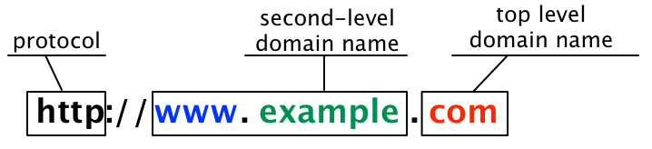
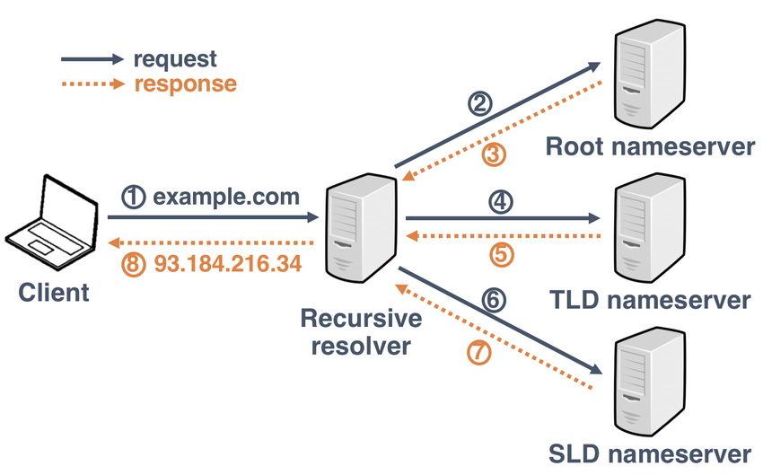
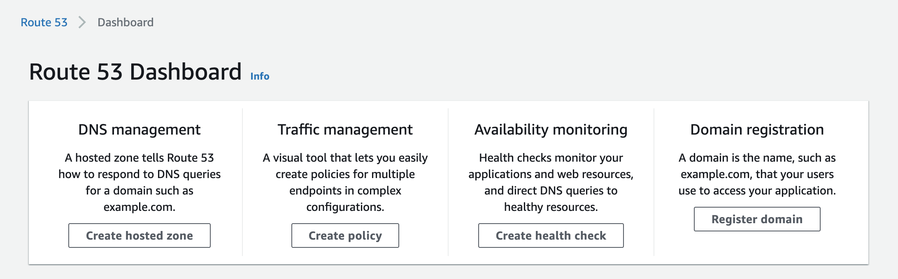
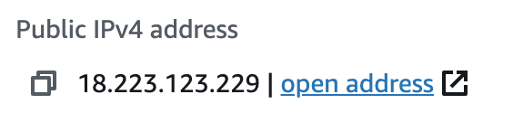
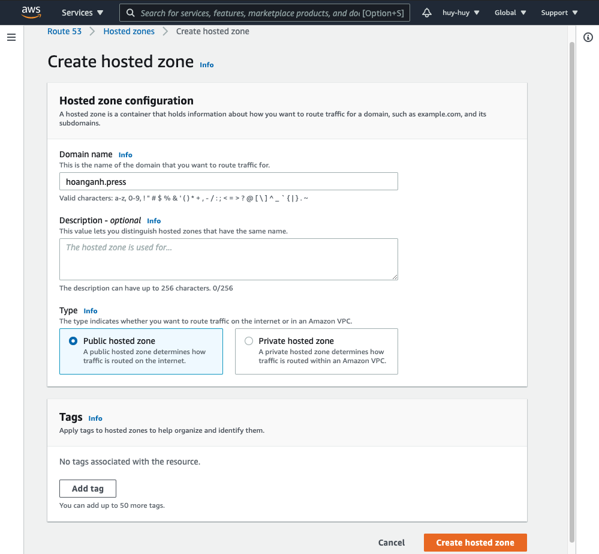
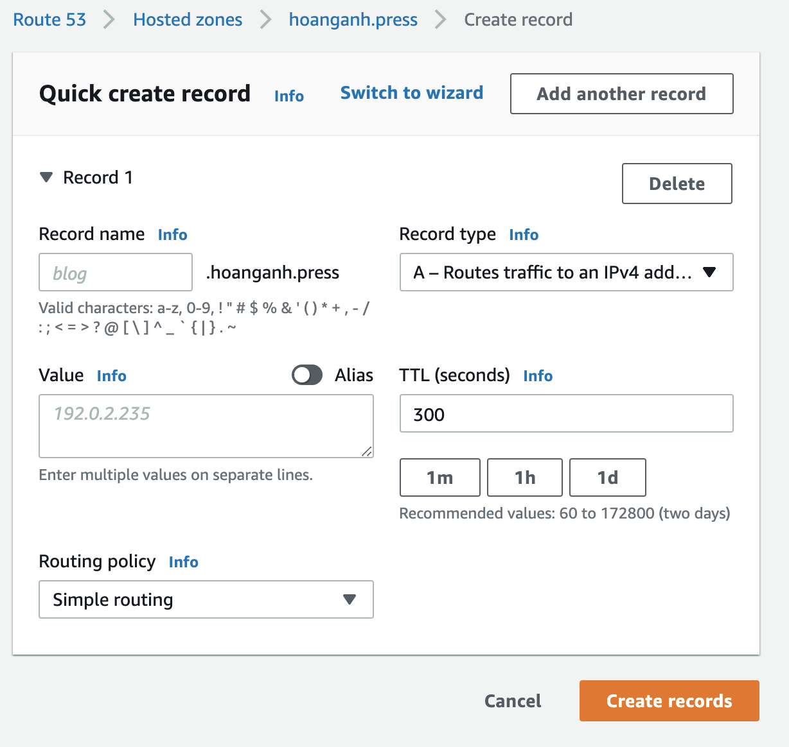

[[snippet]]
| Route 53 dịch vụ cung cấp chức năng phân giải và đăng ký tên miền cung cấp bởi AWS. Route 53 được đặt tên theo con đường liên bang lịch sử đầu tiên của đất nước Mỹ `Route 66` và `53` chính là port lắng nghe của dịch vụ DNS

Trước khi tìm hiểu và đi vào sử dụng Route 53 chúng ta hãy cùng ôn lại một số khái niệm cơ bản trước nhé.

### Domain và DNS là gì?

   Đầu tiên là **domain** hay còn gọi là **tên miền,** là địa chỉ trang web mà mọi người nhập vào thanh URL của trình duyệt để truy cập vào một website. Domain có tác dụng để thay thế 1 địa chỉ IP dài và khó nhớ như: `123.45.67.89` trên internet  thành một “**Domain name**” có dạng là **www.example.com**.

**Domain levels**

	
	Tính từ bên phải sang
1. Top-level domain ví dụ tên miền như là `.com`, `.net`, `.org`,...
2. Second-level domain là tên miền gợi nhớ cho người dùng đến trang web của bạn
3. Third-level domain hay thường được gọi là sub domain là tuỳ chọn của bạn ví dụ như `www`, `admin`, `user`, ...

**DNS** (Domain Name System) là hệ thống phân giải tên miền.

   Cách DNS hoạt động
   

Khi người dùng có một request từ brower thì request đầu tiên phải đi qua một hệ thống trung gian của nhà mạng gọi là `Recursive Resolver`

1. Trước tiên `Recursive Resolver` gửi một request đến `Root nameserver` trên toàn cầu để được nhận về Top-lever.
2. Tiếp theo `Recursive Resolver` lại gửi request đến `TDL manaserver` (Top-lever namesever) để được nhận được Second-level domain.
3. Cuối cùng `Recursive Resolver` lại gửi request đến `SDL manaserver` (Second-lever namesever) để được nhận được địa chỉ IP của trang web chúng ta

Ngoài ra `Recursive Resolver` sẽ cache thông tin địa chỉ này lại để tăng tốc độ cho những lần request sau

### Route 53

Route 53 cung cấp các dịch vụ 

- DNS Management hay còn gọi là DNS server chính là dịch vụ `Recursive Resolver` đã đề cập ở trên.
- Traffic management dịch vụ quản lý traffic vào ra của DNS
- Availablity monitoring dịch vụ theo dõi, health check DNS hoạt động
- Domain registration là dịch vụ đăng ký mua tên miền, bạn có thể sử dụng các server khác để mua chẳng hạn như [hostinger.vn](https://www.hostinger.vn/)

### Sử dụng Route 53

1. Đầu tiên bạn hãy chuẩn bị cho mình một server bằng dịch vụ EC2 nhé. Sau khi hoàn thành thì IP mà bạn muốn domain định tuyến tới sẽ như thế này

  

2. Tạo một Hosted Zone

   Hosted Zone là gì? Hosted Zone là một khái niệm trong AWS là nơi quản lý tương ứng với một domain của bạn. Bạn sẽ tạo ra các `record` để tiến hành config và định tuyến cho domain của bạn.

   
   
   Bạn hãy chọn là `Public Hosted Zone` để DNS của bạn được ra ngoài global.  `Private hosted zone` thì chỉ có tác dụng trong máy ảo VPC.
   
   Sau khi tạo một Hosted zone thì AWS cung cấp cho bạn  4 `nameserver` phụ trách phân giải domain được rải đều các nơi trên thế giới.
   > ns-1093.awsdns-08.org.
   > ns-464.awsdns-58.com.
   > ns-1816.awsdns-35.co.uk.
   > ns-812.awsdns-37.net.

3. Nếu bạn đã đăng ký mua domain ở các dịch vụ khác thì bạn phải chuyển quyền quản lý của domain này đến nameserver của AWS. Nhập 4 nameserver của AWS cung cấp vào nameserver. Bạn phải chờ một thời gian dể dịch vụ của bạn cập nhật nameserver mới
   
4. Ok! Bây giờ chúng ta tiến hành định tuyến domain đến server đã tạo bằng một record mới nhé

   

  Trong đó thì:

- TTL (Time to leave) là thời gian dữ liệu được cache lại những request giống nhau trong DNS server mục đích để tăng tốc độ
- Value nơi nhập một địa chỉ IP hoặc danh sách IP các server tương ứng bạn muốn định tuyến tới
- Record type:
  - A : dùng cho địa chỉ IPv4
  - AAAA : dùng cho địa chỉ IPv6
  - CNAME : dùng để định tuyến cho một domain khác đến với server của bạn, ngoài ra còn thường được sử dụng để định tuyến subdomain tới domain chính của bạn
- Routing Policy:
  1. Simple routing: chỉ có một record cho nhiều IP tương ứng với các server khác nhau. Route 53 định tuyến đến các server ngẫu nhiên trong danh sách IP của bạn
  2. Weight: phân bố tỷ lệ domain định tuyến đến các IP của server, tất nhiên bạn cũng phải tạo mỗi record cho mỗi IP để phân chia tỉ lệ này
  3. Latency: định tuyến đến server nhanh nhất. Route 53 sẽ gửi `Health Check` để kiểm tra  server nào sẽ có độ trễ ít nhất
  4. Geolocation: định tuyến đến server gần với người dùng nhất

### Tóm lại

Như vậy mình đã giới thiệu đến các bạn các khái niệm và concept trong Route 53. Cũng thật thú vị phải không nào. Hy vọng các bạn sẽ có cái nhìn tổng quan hơn về dịch vụ này và có thể áp dụng linh hoạt trong từng bài toán, dự án cụ thể của mình. Cám ơn các bạn đã xem.

[[author | Huy Nguyen ]]
