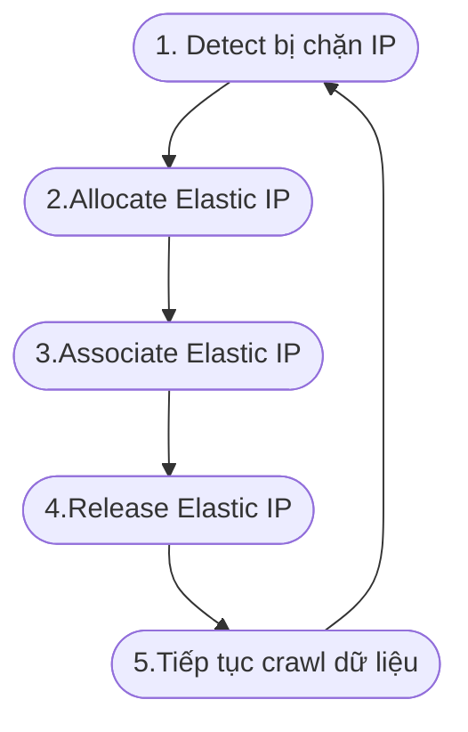

`Crawling` dữ liệu không phải là khái niệm quá xa lạ, nhưng để lấy dữ liệu từ một website đôi khi chúng ta cũng hay gặp tình trạng bị chặn IP dẫn đến server không thể tiếp lục dữ liệu.
#### Ý tưởng.
Ý tưởng để giải quyết vấn đề đấy là chúng ta sẽ tiến hành tạo một service IP rotator để renew lại IP khi website hoặc API chúng ta muốn lấy dữ liệu chặn IP.

Ý tưởng có vẻ hay nhưng vấn đề là làm sao chúng ta có một lượng địa chỉ IP đủ lớn để thay đổi cho server và thời gian thay đổi IP cho server có quá mất thời gian hay khó khăn.

Rất may là AWS có một dịch vụ với tên gọi là [Elastic IP](https://docs.aws.amazon.com/AWSEC2/latest/UserGuide/elastic-ip-addresses-eip.html) , cho phép tạo ra một IP và đính kèm vào server, tất nhiên server trong trường hợp này chúng ta phải sử dụng EC2 :))).

Với `Elastic IP` thì sẽ không bị tính phí phát sinh nếu bạn tạo ra một địa chỉ ip mới được gán vào cho EC2 và phải xoá ip cũ đi.

#### Giải pháp.
Thiên Thời Địa Lợi Nhân Hòa đều hội tụ ở đây cả chứ đâu, hay tiến hành thiết kế một sơ đồ để chúng ta có cái nhìn rõ hơn.


#### Viết code để triển khai ý tưởng.
 Tôi tạo một file mới đặt tên `aws-ip-rotator.sh`. Ở đây mình dùng `shell script` và `aws-cli` để viết code, các dịch vụ của aws hầu như đều có thư viện cho hầu hết các ngôn ngữ lập trình hay dùng. Nên chúng ta hoàn toàn có thể triển khai ý tưởng bằng các ngôn ngữ khác như ruby, php, nodejs,...

```sh
#!/usr/bin/env bash

INSTANCE=$(curl -s http://169.254.169.254/latest/meta-data/instance-id)
OLD_IP=$(curl -s http://169.254.169.254/latest/meta-data/public-ipv4)
OLD_ALLOCATION_ID=$(aws ec2 describe-addresses --public-ips $OLD_IP --query "Addresses[0].AllocationId" | tr -d '"')
NEW_IP=$(aws ec2 allocate-address --query PublicIp | tr -d '"')
aws ec2 associate-address --instance-id $INSTANCE --public-ip $NEW_IP
aws ec2 release-address --allocation-id $OLD_ALLOCATION_ID
```

#### Giải thích chi tiết 6 dòng code.

- Dòng 3: Lấy giá trị Instance ID của EC2 hiện tại đang request.
- Dòng 4: Lấy địa chỉ IP hiện tại của EC2.
- Dòng 5: Lấy Allocation ID của IP hiện tại liên kết với EC2.
- Dòng 6: Tạo ra một địa chỉ IP hoàn toàn mới để thay thế cho IP hiện tại.
- Dòng 7: Đính kèm IP mới vào EC2.
- Dòng 8: Xoá IP cũ để tránh AWS tính thêm phí phát sinh.

 Vậy là chúng ta đã tạo ra một IP rotator chỉ với 6 dòng code, với đoạn code trên nó có thể hoạt động đối với EC2-Classic và cả EC2-VPC. Chúng ta cũng có thể chạy trực tiếp file code ở trên trong  dự án hoặc  cũng có thể setting một con cronjob.
