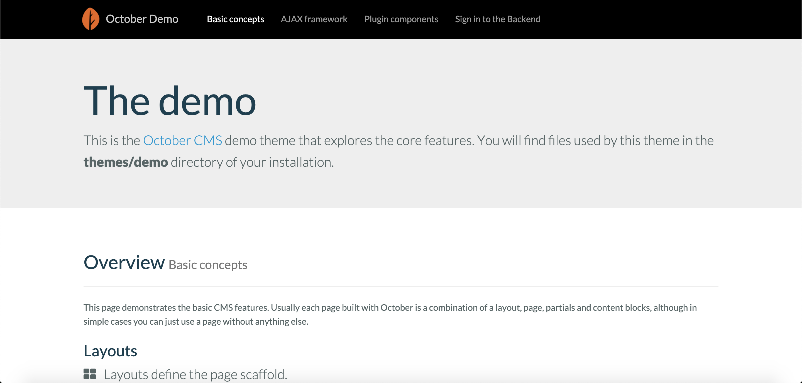
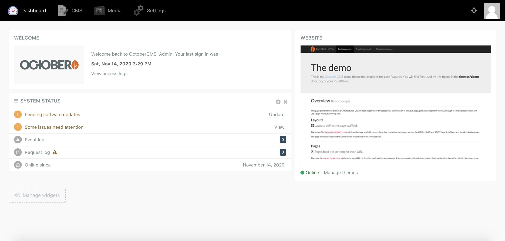

October là một hệ thống quản trị nội dung trên nền tảng web với mục đích khiến công việc phát triển ứng dụng web trở nên đơn giản, thân thiện hơn cho người dùng, được phát triển bằng ngôn ngữ PHP trên nền tảng Framework Laravel nổi tiếng. Là một CMS đa năng mạnh mẽ với cộng đồng lập trình viên xây dựng mạnh mẽ, October cho thấy một viễn tưởng sáng giá cho CMS thay thế WordPress trong thời gian tới. Dựa trên Framework Laravel do đó nó là CMS phổ biến đầu tiền được các lập trình viên quen thuộc Laravel lựa chọn.


October CMS được thiết kế dựa trên MVC pattern và chứa đựng framework Laravel trong đó, điều này khiến cho lập trình viên thoải mái trong quá trình phát triển, source code được tổ chức tốt hơn so với Wordpress.

# Cài đặt và sử dụng OctoberCMS

Chúng ta có thể sử dụng composer để cài đặt OctoberCMS và generate ra base project.
Bạn tiến hành download source code về bằng lệnh

```none
composer create-project october/october october
```

Trong quá trình cài đặt có thể xảy ra lỗi do OctoberCMS require 1 vài extension, bạn cần cài đặt thêm và enable chúng

-   PHP version 7.0.8 or higher
-   PDO PHP Extension
-   CURL PHP Extension
-   OpenSSL PHP Extension
-   Mbstring PHP Library
-   ZipArchive PHP Library
-   GD PHP Library

Tiếp theo bạn cần chạy command  `october:install`  để thực hiện init các cài đặt cơ bản cho CMS

```bash
$ cd october
$ php artisan october:install  
.====================================================================.
                                                                      
 .d8888b.   .o8888b.   db  .d8888b.  d8888b. d88888b d8888b.  .d888b. 
.8P    Y8. d8P    Y8   88 .8P    Y8. 88  `8D 88'     88  `8D .8P , Y8.
88      88 8P      oooo88 88      88 88oooY' 88oooo  88oobY' 88  |  88
88      88 8b      ~~~~88 88      88 88~~~b. 88~~~~  88`8b   88  |/ 88
`8b    d8' Y8b    d8   88 `8b    d8' 88   8D 88.     88 `88. `8b | d8'
 `Y8888P'   `Y8888P'   YP  `Y8888P'  Y8888P' Y88888P 88   YD  `Y888P' 
                                                                      
`=========================== INSTALLATION ==========================='

 Database type:
  [0] MySQL
  [1] Postgres
  [2] SQLite
  [3] SQL Server
 > 0

 MySQL Host [localhost]:
 > 

 MySQL Port [3306]:
 > 

 Database Name [database]:
 > october

 MySQL Login [root]:
 > 

 MySQL Password []:
 > xxx

Enter a new value, or press ENTER for the default

 First Name [Admin]:
 > 

 Last Name [Person]:
 > 

 Email Address [admin@domain.tld]:
 > 

 Admin Login [admin]:
 > 

 Admin Password [admin]:
 > 

 Is the information correct? (yes/no) [yes]:
 > 

 Application URL [http://localhost]:
 > 

 Configure advanced options? (yes/no) [no]:
 > 

Application key [zR0wiN1CtmC6JawIW0pscCzNyIN5y1Qz] set successfully.
Migrating application and plugins...
Migration table created
System
Migrating: 2013_10_01_000001_Db_Deferred_Bindings
...
October.Demo
- v1.0.1:  First version of Demo
Seeded System 
Seeded Backend 
.=========================================.
                ,@@@@@@@,                  
        ,,,.   ,@@@@@@/@@,  .oo8888o.      
     ,&%%&%&&%,@@@@@/@@@@@@,8888\88/8o     
    ,%&\%&&%&&%,@@@\@@@/@@@88\88888/88'    
    %&&%&%&/%&&%@@\@@/ /@@@88888\88888'    
    %&&%/ %&%%&&@@\ V /@@' `88\8 `/88'     
    `&%\ ` /%&'    |.|        \ '|8'       
        |o|        | |         | |         
        |.|        | |         | |         
`========= INSTALLATION COMPLETE ========='


```

Sau khi install xong xuôi, chỉ cần chạy 

```bash
php artisan serve
```

để chạy và thử nghiệm nó thôi.

OctoberCMS cũng giống các CMS khác đều chia thành hai phần:

-   Frontend: Chính là phần website của chúng ta, nơi các thông tin, hình ảnh được đưa lên để mọi người có thể đọc và tương tác với chúng. Để truy cập trang frontend bạn vào  [http://localhost:8000/](http://localhost:8000/). Đây là giao diện frontend sau khi mình đã cài đặt thành công:



- Backend: là vùng quản trị, nơi chúng ta quản lý nội dung (thêm, sửa, xóa). Truy cập backend  [http://localhost:8000/backend](http://localhost:8000/backend)  (admin/admin) để trải nghiệm các tính năng mà OctoberCMS đã cài đặt sẵn cho chúng ta.



Cấu trúc thư mục của dự án


## Các thành phần của Backend

Giao diện bảng điều khiển (dashboard) của OctoberCMS khá đơn giản với trên cùng là thanh menu điều hướng bao gồm:
-   Dashboard: Nơi hiển thị các thông tin điều khiển như thông tin tình trạng hệ thống , các Widget.
-   CMS: Đây chính là phần lõi tạo ra các trang web mà sẽ hiển thị ở frontend. Phần này sẽ là nơi chúng ta xử lý mọi vấn đề xoay quanh giao diện website.
-   Media: Công cụ quản lý các tài nguyên đa phương tiện như hình ảnh, âm thanh, video và các tài nguyên khác.
-   Settings: Tại đây chúng ta thiết lập các thông số, thuộc tính cho các thành phần của OctoberCMS.
-   Account: Nơi quản lý thông tin tài khoản.
