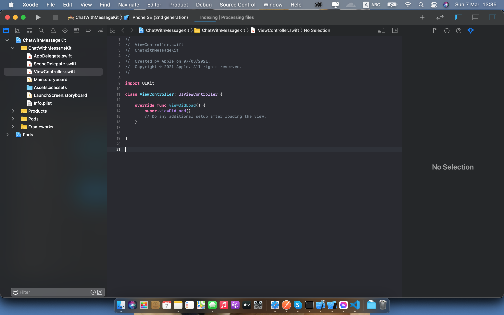
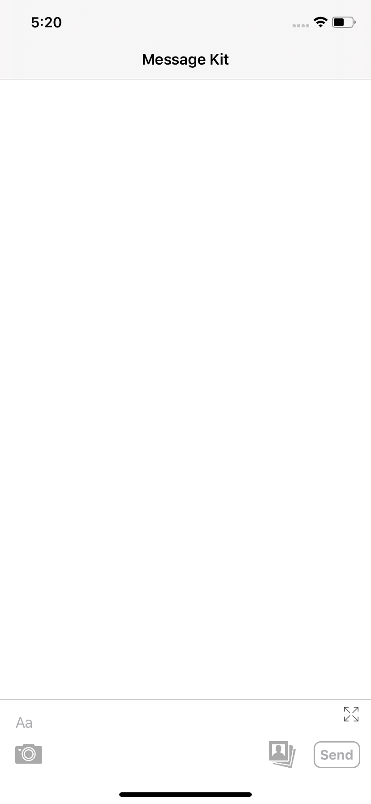
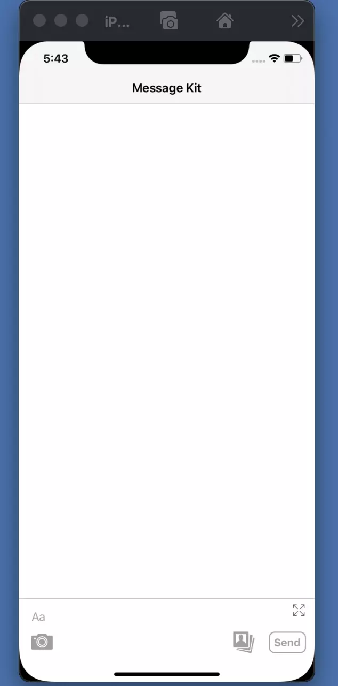

# MessageKit Là Gì ?
[[snippet]]
|    **MessageKit** là một thư viện mã nguồn mở dùng để tạo ra màn hình chat với chuẩn về UX UI.

Github: [MessageKit](https://github.com/MessageKit/MessageKit)

### Cấu trúc của MessageKit

1. Cấu trúc của Cell.
   MessageKit chia làm hai loại Cell đó là mặc định và custom. Cell mặc định đó là những Cell do MessageKit cung cấp cho chúng ta, chúng kế thừa từ class **MessageContentCell**. Cell custom là những Cell mà ta tự custom, chúng kế thừa từ class **UICollectionViewCell**.

   Với Cell mặc định còn chia thành nhiều loại khác nhau gồm: TextMessageCell, MediaMessageCell, LocationMessageCell, AudioMessageCell, ContactMessageCell, LinkPreviewMessageCell.

   Hãy xem kiểu MessageKind được define trong MessageKit như sau:

   ```swift
   public enum MessageKind {
    case text(String) // TextMessageCell
    case attributedText(NSAttributedString) // TextMessageCell
    case photo(MediaItem) // MediaMessageCell
    case video(MediaItem) // MediaMessageCell
    case location(LocationItem) // LocationMessageCell
    case emoji(String) // TextMessageCell
    case audio(AudioItem) // AudioMessageCell
    case contact(ContactItem) // ContactMessageCell
    case linkPreview(LinkItem) // LinkPreviewMessageCell

    /// A custom message.
    /// - Note: Using this case requires that you implement the following methods and handle this case:
    ///   - MessagesDataSource: customCell(for message: MessageType, at indexPath: IndexPath, in messagesCollectionView: MessagesCollectionView) -> UICollectionViewCell
    ///   - MessagesLayoutDelegate: customCellSizeCalculator(for message: MessageType, at indexPath: IndexPath, in messagesCollectionView: MessagesCollectionView) -> CellSizeCalculator
    case custom(Any?)
   }
   ```
    Tất cả những Cell mặc định trên đều sẽ kế thừa từ MessageContentCell nên nó đều có cấu trúc giống như sau:
    
    Nó chia làm 7 phần, lần lượt từ dưới xuống đó là: cellTopLabel, messageTopLabel, messageContainerView, messageBottomLabel, cellBottomLabel và hai phần đặc biệt đó là avatarView, accessoryView.
 2. Cấu trúc của MessageInputBar.
    MessageInputBar là class được MessageKit tích hợp từ thư viện [InputBarAccessoryView](https://github.com/nathantannar4/InputBarAccessoryView). MessageInputBar có cấu trúc như sau:
    
    Với cấu trúc như trên thì nó rất dễ để customize như thay đổi size, thêm các button.
### Demo
Tới đây chúng ta sẽ cùng implement một màn hình Chat đơn giản với MessageKit.
Đầu tiên, cần khởi tạo project với XCode và pod install với lệnh sau được thêm vào file Podfile.
```
pod 'MessageKit'
```
Vì MessageKit đã tích hợp sẵn với InputBarAccessoryView nên ta không cần phải install InputBarAccessoryView nữa.
Project của chúng ta sẽ như thế này sau khi khởi tạo:

MessageKit cung cấp cho chúng ta một UIViewController là MessagesViewController, đây là class đã cung cấp sẵn một UICollectionView, và các thuộc tính và phương thức tiện ích để xử lý keyboard, show thời gian khi swipe, ... Có một vấn đề là do Swift không hỗ trợ đa kế thừa nên không thể dùng ViewController kế thừa trực tiếp MessagesViewController được vì ViewController cần phải kế thừa BaseVC. Cho nên chúng ta cần tạo ra một class là MessageController cho việc kế thừa MessagesViewController và sẽ add MessageController vào trong ViewController.
MessageController sau khi khởi tạo như sau:
```swift
import MessageKit
import Foundation

class MessageController: MessagesViewController {
    weak var viewController: ViewController?
    
    override func viewDidLoad() {
        super.viewDidLoad()
    }
}
```
Add MessageController vào ViewController:
```swift
import MessageKit
import UIKit

class ViewController: UIViewController {

    private lazy var messageController: MessageController = {
        let vc = MessageController()
        vc.viewController = self
        return vc
    }()
    
    override func viewDidLoad() {
        super.viewDidLoad()

        addChild(messageController)
        messageController.view.autoresizingMask = [.flexibleWidth, .flexibleHeight]
        messageController.view.frame = view.bounds
        view.addSubview(messageController.view)
    }
}
```
Sau đó ở MessageCollectionView, ta cần config MessageCollectionView và config MessageInputBar.
Config MessageCollectionView thì dùng hàm sau:
```swift
func configureMessageCollectionView() {
        messagesCollectionView.messagesDataSource = self
        messagesCollectionView.messageCellDelegate = self
        messagesCollectionView.messagesLayoutDelegate = self
        messagesCollectionView.messagesDisplayDelegate = self
        scrollsToLastItemOnKeyboardBeginsEditing = true // default false
        maintainPositionOnKeyboardFrameChanged = true // default false
        showMessageTimestampOnSwipeLeft = true // default false
        
        // Với những Cell của message do currentUser gửi thì sẽ không hiển thị avatar
        if let layout = messagesCollectionView.collectionViewLayout as? MessagesCollectionViewFlowLayout {
            layout.textMessageSizeCalculator.outgoingAvatarSize = .zero
            layout.textMessageSizeCalculator.outgoingMessageBottomLabelAlignment.textInsets.right = 12
            layout.photoMessageSizeCalculator.outgoingAvatarSize = .zero
            layout.photoMessageSizeCalculator.outgoingMessageBottomLabelAlignment.textInsets.right = 12
        }
    }
```
Về MessageInputBar thì có thể dùng luôn biến messageInputBar được define sẵn trong class MessagesViewController hoặc dùng một input bar tự custom khác. Ở đây, mình dùng một MessageInputBar tự custom như sau:
```swift
import InputBarAccessoryView
import UIKit

protocol SlackInputBarDelegate: class {
    func slackInputBar(_ view: SlackInputBar, didTapCameraButton button: InputBarButtonItem)
    func slackinputBar(_ view: SlackInputBar, didTapLibraryButton button: InputBarButtonItem)
}

final class SlackInputBar: InputBarAccessoryView {
    weak var slackDelegate: SlackInputBarDelegate?

    override init(frame: CGRect) {
        super.init(frame: frame)
        configure()
    }

    required init?(coder aDecoder: NSCoder) {
        fatalError("init(coder:) has not been implemented")
    }

    func configure() {
        let items = [
            makeButton(named: "ic_camera").onTextViewDidChange { button, textView in
                button.isEnabled = textView.text.isEmpty
            }.onSelected { [weak self] item in
                guard let self = self else { return }
                item.tintColor = .systemBlue
                self.slackDelegate?.slackInputBar(self, didTapCameraButton: item)
            },
            .flexibleSpace,
            makeButton(named: "ic_library")
                .onSelected { [weak self] item in
                    guard let self = self else { return }
                    item.tintColor = .systemBlue
                    self.slackDelegate?.slackinputBar(self, didTapLibraryButton: item)
                },
            sendButton
                .configure {
                    $0.layer.cornerRadius = 8
                    $0.layer.borderWidth = 1.5
                    $0.layer.borderColor = $0.titleColor(for: .disabled)?.cgColor
                    $0.setTitleColor(.white, for: .normal)
                    $0.setTitleColor(.white, for: .highlighted)
                    $0.setSize(CGSize(width: 52, height: 30), animated: false)
                }.onDisabled {
                    $0.layer.borderColor = $0.titleColor(for: .disabled)?.cgColor
                    $0.backgroundColor = .clear
                }.onEnabled {
                    $0.backgroundColor = .systemBlue
                    $0.layer.borderColor = UIColor.clear.cgColor
                }.onSelected {
                    // We use a transform because changing the size would cause the other views to relayout
                    $0.transform = CGAffineTransform(scaleX: 1.2, y: 1.2)
                }.onDeselected {
                    $0.transform = CGAffineTransform.identity
                },
        ]
        items.forEach { $0.tintColor = .lightGray }

        // We can change the container insets if we want
        inputTextView.textContainerInset = UIEdgeInsets(top: 8, left: 0, bottom: 8, right: 0)
        inputTextView.placeholderLabelInsets = UIEdgeInsets(top: 8, left: 5, bottom: 8, right: 5)

        let maxSizeItem = InputBarButtonItem()
            .configure {
                $0.image = UIImage(named: "icons8-expand")?.withRenderingMode(.alwaysTemplate)
                $0.tintColor = .darkGray
                $0.setSize(CGSize(width: 20, height: 20), animated: false)
            }.onSelected {
                let oldValue = $0.inputBarAccessoryView?.shouldForceTextViewMaxHeight ?? false
                $0.image = oldValue ? UIImage(named: "icons8-expand")?.withRenderingMode(.alwaysTemplate) : UIImage(named: "icons8-collapse")?.withRenderingMode(.alwaysTemplate)
                self.setShouldForceMaxTextViewHeight(to: !oldValue, animated: true)
            }
        rightStackView.alignment = .top
        setStackViewItems([maxSizeItem], forStack: .right, animated: false)
        setRightStackViewWidthConstant(to: 20, animated: false)

        // Finally set the items
        setStackViewItems(items, forStack: .bottom, animated: false)

        shouldAnimateTextDidChangeLayout = true
    }

    private func makeButton(named: String) -> InputBarButtonItem {
        return InputBarButtonItem()
            .configure {
                $0.spacing = .fixed(10)
                $0.image = UIImage(named: named)?.withRenderingMode(.alwaysTemplate)
                $0.setSize(CGSize(width: 30, height: 30), animated: false)
            }.onSelected {
                $0.tintColor = .systemBlue
            }.onDeselected {
                $0.tintColor = UIColor.lightGray
            }
    }
}
```
Sau đó ta tạo một instance của SlackInputBar ở MessageController và setup cho nó như sau:
```swift
lazy var slackInputBar = SlackInputBar()

func configureMessageInputBar() {
    slackInputBar.slackDelegate = self
    slackInputBar.delegate = self
}
```

Để hiển thị được SlackInputBar thì cần setup như sau ở ViewController:

```swift
override var inputAccessoryView: UIView? {
    return messageVC.slackInputBar
}

override var canBecomeFirstResponder: Bool {
    return true
}
```
Lúc này, khi run app, ta có thể nhận được màn hình màn Chat như sau:

Tiếp theo, ta sẽ cần implement phần Chat, ta làm phần này trên class MessageController. Tuy nhiên trước tiên cần phải implement hai model là User và Message.
**User**
```swift
import MessageKit
import Foundation

struct User: SenderType {
    var senderId: String
    var displayName: String
}
```

**Message**
```swift
import Foundation
import MessageKit
import UIKit

private struct ImageMediaItem: MediaItem {
    var url: URL?
    var image: UIImage?
    var placeholderImage: UIImage
    var size: CGSize

    init(image: UIImage) {
        self.image = image
        size = CGSize(width: 240, height: 240)
        placeholderImage = UIImage()
    }

    init(imageURL: URL) {
        url = imageURL
        size = CGSize(width: 240, height: 240)
        placeholderImage = UIImage(imageLiteralResourceName: "image_message_placeholder")
    }
}

struct Message: MessageType {
    var sender: SenderType
    var messageId: String
    var sentDate: Date
    var kind: MessageKind

    private init(sender: SenderType, messageId: String, sentDate: Date, kind: MessageKind) {
        self.sender = sender
        self.messageId = messageId
        self.sentDate = sentDate
        self.kind = kind
    }

    init(sender: SenderType, messageId: String, sentDate: Date, text: String) {
        self.init(sender: sender, messageId: messageId, sentDate: sentDate, kind: .text(text))
    }

    init(sender: SenderType, messageId: String, sentDate: Date, image: UIImage) {
        let mediaItem = ImageMediaItem(image: image)
        self.init(sender: sender, messageId: messageId, sentDate: sentDate, kind: .photo(mediaItem))
    }
}
```
Ở MessageController ta cần implement những protocol sau:  MessagesDataSource, MessageCellDelegate, InputBarAccessoryViewDelegate, MessagesDisplayDelegate, MessagesLayoutDelegate, SlackInputBarDelegate, UIImagePickerControllerDelegate, UINavigationControllerDelegate.
MessagesDataSource cung cấp những phương thức để truyền data vào cho các Cell. Ví dụ như sau:
```swift
// MARK: - MessagesDataSource
func currentSender() -> SenderType {
    return currentUser
}

func messageForItem(at indexPath: IndexPath, in messagesCollectionView: MessagesCollectionView) -> MessageType {
    return messageList[indexPath.section]
}

func numberOfSections(in messagesCollectionView: MessagesCollectionView) -> Int {
    return messageList.count
}
```

MessagesDisplayDelegate cung cấp những phương thức để custom hiển thị của một Cell. Ví dụ như sau, ta custom việc hiển thị của AvatarView:
```swift
// MARK: - MessagesDisplayDelegate
func configureAvatarView(_ avatarView: AvatarView, for message: MessageType, at indexPath: IndexPath, in messagesCollectionView: MessagesCollectionView) {
    if message.sender.senderId == currentSender().senderId {
        avatarView.isHidden = true
    } else {
        avatarView.backgroundColor = .red
    }
}
```
InputBarAccessoryViewDelegate cung cấp những phương thức cho việc xử lý các tương tác của người dùng với MessageInputBar như tap send button, ... Dưới đây là việc xử lý gửi một tin nhắn do người dùng nhập từ bàn phím và bấm vào nút Send.
```swift
// MARK: - InputBarAccessoryViewDelegate
func inputBar(_ inputBar: InputBarAccessoryView, didPressSendButtonWith text: String) {
    processInputBar(slackInputBar)
}

func processInputBar(_ inputBar: InputBarAccessoryView) {
    // Here we can parse for which substrings were autocompleted
    let attributedText = inputBar.inputTextView.attributedText!
    let range = NSRange(location: 0, length: attributedText.length)
    attributedText.enumerateAttribute(.autocompleted, in: range, options: []) { _, range, _ in

        let substring = attributedText.attributedSubstring(from: range)
        let context = substring.attribute(.autocompletedContext, at: 0, effectiveRange: nil)
        print("Autocompleted: `", substring, "` with context: ", context ?? [])
    }

    let components = inputBar.inputTextView.components
    inputBar.inputTextView.text = String()
    inputBar.invalidatePlugins()
    // Send button activity animation
    inputBar.sendButton.startAnimating()
    inputBar.inputTextView.placeholder = "Sending..."
    // Resign first responder for iPad split view
    inputBar.inputTextView.resignFirstResponder()
    DispatchQueue.global(qos: .default).async {
        // fake send request task
        sleep(1)
        DispatchQueue.main.async { [weak self] in
            inputBar.sendButton.stopAnimating()
            inputBar.inputTextView.placeholder = "Aa"
            self?.insertMessages(components)
            self?.messagesCollectionView.scrollToLastItem(animated: true)
        }
    }
}

private func insertMessages(_ data: [Any]) {
    for object in data {
        if let text = object as? String {
            let message = Message(sender: currentUser, messageId: String(Int.random(in: 0 ..< 100)), sentDate: Date(), text: text)
            insertMessage(message)
        } else if let image = object as? UIImage {
            let message = Message(sender: currentUser, messageId: String(Int.random(in: 0 ..< 100)), sentDate: Date(), image: image)
            insertMessage(message)
        }
    }
}

func insertMessage(_ message: Message) {
    messageList.append(message)
    // Reload last section to update header/footer labels and insert a new one
    messagesCollectionView.performBatchUpdates({
        messagesCollectionView.insertSections([messageList.count - 1])
        if messageList.count >= 2 {
            messagesCollectionView.reloadSections([messageList.count - 2])
        }
    }, completion: { [weak self] _ in
        if self?.isLastSectionVisible() == true {
            self?.messagesCollectionView.scrollToLastItem(animated: true)
        }
    })
}

func isLastSectionVisible() -> Bool {
    guard !messageList.isEmpty else { return false }
    let lastIndexPath = IndexPath(item: 0, section: messageList.count - 1)
    return messagesCollectionView.indexPathsForVisibleItems.contains(lastIndexPath)
}
```
Để gửi một tin nhắn thì ta cần xác định được model Message là gì, rồi add vào array messageList và reload collectionView, MessageKit sẽ tự làm những việc còn lại.
SlackInputBarDelegate cung cấp hai func cho việc xử lý việc user tap và nút camera và nút show library.
```swift
// MARK: - SlackInputBarDelegate
func slackInputBar(_ view: SlackInputBar, didTapCameraButton button: InputBarButtonItem) {
    print("Show camera")
}

func slackinputBar(_ view: SlackInputBar, didTapLibraryButton button: InputBarButtonItem) {
    let pickerVC = UIImagePickerController()
    pickerVC.sourceType = .photoLibrary
    pickerVC.modalPresentationStyle = .fullScreen
    pickerVC.delegate = self
    pickerVC.allowsEditing = true
    viewController?.present(pickerVC, animated: true, completion: nil)
}
```
Sau khi user chọn ảnh ở Photo library xong thì chỉ cần tạo một message và insert vào là xong.
```swift
// MARKL - UIImagePickerControllerDelegate
func imagePickerControllerDidCancel(_ picker: UIImagePickerController) {
    picker.dismiss(animated: true, completion: nil)
}

func imagePickerController(_ picker: UIImagePickerController, didFinishPickingMediaWithInfo info: [UIImagePickerController.InfoKey: Any]) {
    guard let image = info[.editedImage] as? UIImage else {
        return
    }
    picker.dismiss(animated: true) { [weak self] in
        guard let self = self else { return }
        let message = Message(sender: self.currentUser, messageId: String(Int.random(in: 0 ..< 100)), sentDate: Date(), image: image)
        self.insertMessage(message)
    }
}
```
Xong xuôi, app của mình hiện giờ đã có thể gửi text và gửi ảnh như đây:

Trên đây là một số hiểu biết của mình về MessageKit, mọi người nếu có ý kiến gì có thể comment ở phía dưới. Cảm ơn và hẹn gặp lại.
Happy Reading!!!
by Nguyen Manh Hung from TOMOSIA Viet Nam.