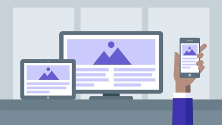

---  
title: "What is responsive website design"  
date: "2021-03-16"  
published: true  
tags:
- html
- css
---  
[[snippet]]
| Responsive Web Design có thể nói là khái niệm rất hot và đang phát triển rất mạnh mẽ hiện nay, hiển nhiên. Responsive Web Design là một công nghệ web mới và đang là 1 trong những xu hướng web hiện nay, nếu bạn vẫn còn chưa thực sụ tin điều này có thể kiểm chứng Google với keyword: “xu hướng web”. Với những điều tôi nói trên thì bạn có thực sự muốn biết nó là gì và nó mang lại lợi ích thiết thực gì đối với việc phát triển web?

## 1. Responsive ra đời thế nào
Trước năm 2013, một  **website**  muốn tương thích với máy tính và điện thoại di động, các lập trình viên phải viết 2 project khác nhau. Project thứ nhất là một ứng dụng  **web**  phục vụ cho những người dùng sử dụng máy tính hoặc máy tính bảng. Và project thứ 2 là ứng dụng  **web**  dành cho những người dùng sử dụng các thiết bị với màn hình bé như điện thoại di động. Điều này thực sự gây ra sự khó khăn trong bảo trì và nâng cấp  **website**, vì bạn phải làm điều đó cho cả 2 project. Ngoài ra 2 chúng phải được triển khai trên 2 tên miền (domain) khác nhau, chẳng hạn:

-   http://example.com
-   http://mobile.example.com

Năm 2013 được coi là năm của các thiết kế  **"Responsive"**, bởi vì người dùng ngày càng ưu chuộng các thiết bị cầm tay nhỏ như máy tính bảng và điện thoại thông minh. Hành vi của đa số người dùng đã thay đổi, họ chuyển dần sang đọc các tin tức của họ thông qua các thiết bị di động.

#### Một Website được gọi là "Responsive" (Có tính đáp ứng), nếu nó tương thích với các thiết bị có độ lớn màn hình khác nhau như máy tính, máy tính bảng (Tablet), điện thoại di động (Mobile).

## 2. Vậy responsive là gì?

Hiểu một cách đơn giản Web Responsive là phong cách thiết kế website làm sao cho phù hợp trên tất cả các thiết bị, mọi độ phân giải màn hình. Một website đẹp trên máy tính nhưng khi xem trên điện thoại bố cục lộn xộn, hình ảnh, bài viết không cân đối thì không thể gọi là Web Responsive

Ví dụ về Web Responsive: Bạn mở trang chủ website Responsive, rồi thu nhỏ trình duyệt hoặc đổi độ phân giải màn hình, bạn sẽ thấy website của mình không hề xuất hiện Scrollbar ngang, mà nó sẽ tự động co dãn sao cho phù hợp với chiều rộng màn hình máy tính bạn.

Hoặc đơn giản và hay bắt gặp nhất là khi bạn sử dụng các thiết bị cảm ứng để lướt web thì với chế độ xoay thiết bị thì hình ảnh , trang web của bạn sẽ chuyển đổi một cách uyển chuyển sang chế độ hiện thị khác. Nó không chỉ đẹp mắt và phù hợp hơn cới màn hình mới mà nó còn tạo hiệu ứng tốt cho người dùng, tất nhiên đó là điều bạn rất cần cho 1 web site của mình đúng không ?

## 3. Sự khác nhau giữa adaptive web và responsive web

Bạn đã bao giờ thắc mắc **adaptive web** và  **responsive web là gì**? Liệu 2 định nghĩa này có khác nhau? Thiết kế web thích ứng (Adaptive web design) sử dụng bố cục riêng biệt cho nhiều kích thước màn hình, bố cục chủ yếu phụ thuộc vào kích thước màn hình được sử dụng.
=> Hiểu đơn giản hơn, với mỗi kích thước màn hình, designer sẽ thiết kế một bố cục cho riêng nó.



Thiết kế web đáp ứng (Responsive web design) cho phép web thích ứng với kích thước của màn hình bất chấp kích thước màn hình của thiết bị đích là gì. Thiết kế web dạng này sử dụng bố cục (layout) theo dạng “chất lỏng” và phương tiện CSS để thay đổi kiểu hình. Bố cục “chất lỏng” này cho phép trang thay đổi kích thước chiều rộng và chiều cao của nó để thích ứng với các kích thước màn hình khác nhau và hiển thị chính xác. Nói cách khác, với thiết kế responsive, designer không phải thiết kế nhiều phiên bản của cùng 1 website để tăng khả năng hiển thị trên đa dạng thiết bị.

## 4. Ưu điểm của Responsive

```Bạn có thể sử dụng Responsive Web ở bất kỳ dự án website nào, bằng bất kỳ ngôn ngữ thiết kế nào, hay bất kỳ một mã nguồn mở nào cũng được vì cốt lõi của nó chỉ là HTML và CSS.```
-   Người dùng có thể đọc rõ văn bản mà không cần phóng to màn hình
-   Giao diện web có đủ khoảng trống, đủ không gian để người dùng thực hiện các hành động (ví dụ như nhấn chính xác vào các nút CTA, menu, vv.)
-   Người dùng không còn phải cuộn ngang màn hình để đọc hết nội dung

Có thể nói Responsive Web sẽ làm cho website chạy tốt trên mọi thiết bị di động, tăng tính tương thích cho website của bạn, tạo độ tin cậy và sự chuyên nghiệp với khách hàng.

## 5. Độ phân giải màn hình thường gặp

Để thực hiện được những gì mà ta mong muốn bên trên thì chúng ta cần phân ra các cỡ màn hình chuẩn cơ bản và set theo các kích thước đó.

| Extra small (xs)|Small (sm)| Medium (md)|  Large (lg)| Extra large (xl) | Extra extra large (xxl)
|--|--|--|--|--|--|
| <576px | ≥576px | ≥768px | ≥992px | ≥1200px | ≥1400px |

## 6. Lợi ích của responsive

Chắc bạn cũng sẽ nhận thấy các lợi ích cơ bản sau:

-   Website có thể truy cập dễ dàng bằng tất cả các thiết bị (đáp ứng được nhu cầu của người sử dụng di động).
-   Thu hút những khách hàng truy cập website trên đường đi.
-   Quản lí nhiều hiển thị chỉ với một lần chỉnh sửa.
-   Giảm chi phí và thời gian thiết kế cho nhiều loại màn hình.
-   Cải thiện seo cho website.

## 7. Những cân nhắc khác cần lưu ý khi thiết kế responsive web

- Thiết kế web đáp ứng với các thiết bị di động đặt ra những thách thức cho nhà phát triển và nhà thiết kế liên quan đến tính chất khác nhau của việc sử dụng **chuột (trên desktop/laptop)** so với việc sử dụng **chạm cảm ứng (trên các thiết bị di động)**.

-  Khi bạn là designer bạn phải tính toán đến việc khi người dùng sử dụng các thiết bị di động để lướt web, mạng di động mà họ sử dụng có thể không phù hợp cho việc tải những hiệu ứng này, dẫn đến việc làm chậm tốc độ tải web. Điều này ảnh hưởng trực tiếp đến quyết định bỏ trang của người dùng. Vậy nên với các phiên bản web hiển thị trên các thiết bị di động, có thể là khôn ngoan khi hiển thị ít đồ họa hơn so với lượt xem trên máy tính để trang web không mất thời gian tải trên điện thoại thông minh.

### => Đồ hoạ vào tốc độ tải web là rất quan trọng 

## 8. Tổng kết

Chắc các bạn cũng đã hiểu sự quan trọng của responsive trong thiết kế website rồi phải không.

<i>Gặp các bạn ở các bài viết khác nhé. See ya!!!</i>

[[author | Thắng Đặng ]]
